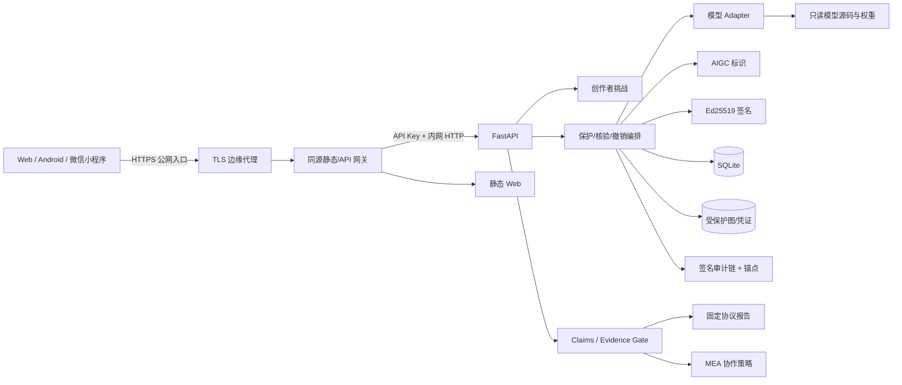
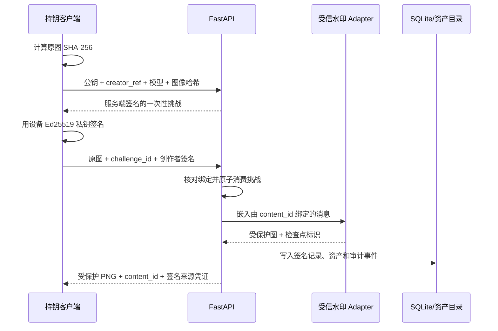

# 鉴源盾内容来源可信取证系统 V1.0 架构

本文档是仓库级架构索引。软著设计细节见 [`docs/software-copyright/设计说明书.md`](docs/software-copyright/设计说明书.md)，API 字段契约见 [`docs/API_CONTRACT.md`](docs/API_CONTRACT.md)，威胁与剩余风险见 [`docs/THREAT_MODEL.md`](docs/THREAT_MODEL.md)。

## 设计定位

系统对已登记图像建立“创作者密钥持有—主动水印—内容编号—签名来源凭证—传播后核验—撤销与审计”链路。它解决的是指定登记记录与待核验内容的匹配问题，不是开放世界 AI 图片真假检测器。

## 逻辑架构

公网 TLS 由应用进程之外的边缘代理终止。仓库提供 Caddy 配置和 HTTP 到 HTTPS 重定向，但配置文件不能证明某个在线实例的证书当前有效；部署验收必须实测证书链、HSTS 和明文入口。

## 目录与职责

| 目录/文件 | 职责 |
| --- | --- |
| `system/backend/` | FastAPI 应用、安全中间件、来源业务、签名、审计、证据和策略 API |
| `system/evaluation/` | 固定攻击协议、模型适配、指标、统计和证据校验 |
| `system/frontend/` | Web 可视化与 trust contracts |
| `system/gateway.py` | 同源静态服务和 API 转发，将 API Key 留在服务端 |
| `android/` | Kotlin/Compose 客户端，设备密钥、挑战、凭证和撤销 |
| `miniprogram/` | 微信小程序交互、本地历史和 fail-closed 展示 |
| `configs/` | 评测协议、声明清单、MEA 策略与权重清单格式 |
| `scripts/` | 发布、证据、评测、离线包与软著包工具 |
| `tests/` | 业务、安全、证据、评测与交付回归测试 |

## 来源保护数据流

后端和 Android 客户端已实现上述一次性挑战。当前 Web 和小程序的直连保护表单尚未提交 `challenge_id` 和 `creator_signature_base64`；生产后端会拒绝缺少这两项的保护请求。

## 核验与结果语义

核验可通过 `content_id`、来源凭证或图片 AIGC 元数据定位记录。结果字段不能合并成一个模糊“真假”结论：

| 字段 | 语义 |
| --- | --- |
| `exact_protected_file_match` | 当前字节是否与登记输出完全相同 |
| `verified` | 恢复水印是否达到该记录的校准阈值 |
| `aigc_metadata_intact` | 已实施的标识、编号与生产者封印是否完整 |
| `claim_valid` | 创作者、权重、校准、签名、审计、撤销和证据门禁是否同时通过 |

## 模型信任边界

模型名称出现在适配器中不代表模型已可用于受信登记。`provenance_ready` 要求实际权重哈希可用、命中审批清单、校准产物通过重算，且权重/校准/清单受固定签名证据覆盖。

当前仓库前端契约测试只将 KAD-Net 设为 `provenance_ready` 正例。部署实例的状态必须以 `/api/models/status` 为准，其他模型只有在同等门禁完整通过后才可开放正式保护。

## 存储与信任边界

- SQLite 保存来源记录、挑战、核验、撤销与审计事件，适用于单机交付，不是多租户高并发数据库。
- 来源保护不持久化原始上传图，但持久化受保护图、原图哈希、创作者应用引用与事件。
- 审计链与独立锚点可检查若干类删改和回滚，但宿主特权、私钥泄露或连同锚点的整体控制仍是外部威胁。
- API Key 是最小鉴权，随机内容编号不是对象级授权。

## 第三方边界

平台使用 LIDMark、KAD-Net、SepMark、WaveGuard、MEA 和 SimSwap 等上游成果以及 LFW、CelebA-HQ 等数据语境。模型底层算法、上游源码、预训练权重、数据集和人物图像不是本平台重新声明的原创作品。详细边界见 [`THIRD_PARTY_NOTICES.md`](THIRD_PARTY_NOTICES.md) 与 [`docs/software-copyright/原创与第三方边界说明.md`](docs/software-copyright/原创与第三方边界说明.md)。
