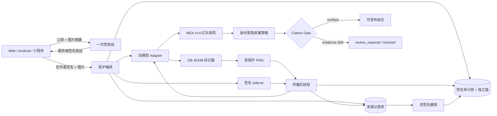

<div align="center">

# 鉴源盾内容来源可信取证系统 V1.0

### JianYuanShield · 面向 AI 生成合成图像的主动溯源、可信凭证与多水印冲突治理平台

[](configs/claims_manifest.v1.json)
[](configs/evaluation_protocol.v1.json)
[](system/backend/signing.py)
[](system/backend/aigc_labeling.py)
[](.github/workflows/quality.yml)
[](tests)
[](docs/GPU_SCALE_EXPERIMENT_20260807.md)

**创作者持钥证明 · 四模型主动水印 · AIGC 双重标识 · 自包含来源凭证 · 防回滚审计 · 签名撤销 · MEA 4×4 红队评测**

**[V1.0 HTTPS 在线演示](https://81.70.178.203/jianyuanshield/)** · [三分钟答辩](docs/DEFENSE_SCRIPT_3MIN.md) · [国一对标卡](docs/NATIONAL_FIRST_SCORECARD.md) · [证据索引](docs/EVIDENCE_INDEX.md) · [核心创新](#核心创新) · [正式实验](#已完成的正式实验) · [快速开始](#快速开始)

</div>

> **一句话定位**：鉴源盾为数字内容建立贯穿创作、传播与争议处置的可信身份链——可运行、可复算、可验签。

## 为什么现在需要鉴源盾

生成合成内容治理正在从“事后识别风险”走向“生成、导出、传播全链路标识”。政策要求解决的是内容标识和平台责任，工程系统还需要继续回答：标识经历压缩、缩放、换脸或二次嵌入后还能否恢复，发生争议时结论能否被独立验证。

| 时间 | 治理信号 | 对项目的技术要求 |
|---|---|---|
| 2022 | 《互联网信息服务深度合成管理规定》提出对生成或编辑内容采取技术措施添加标识 | 内容需要可识别、记录可追溯 |
| 2023 | 《生成式人工智能服务管理暂行办法》强调促进发展、规范应用和保护合法权益 | 创新能力与安全边界同时落地 |
| 2025 | 《人工智能生成合成内容标识办法》推动显式标识、隐式标识和传播责任协同 | 标识需要贯穿生成、导出与传播环节 |
| 鉴源盾 | 主动水印 + 来源凭证 + 攻击评测 + 签名审计 | 补齐跨攻击鲁棒核验与争议举证闭环 |

对应官方文件：[深度合成管理规定](https://www.cac.gov.cn/2022-12/11/c_1672221949354811.htm) · [生成式人工智能服务管理暂行办法](https://www.cac.gov.cn/2023-07/13/c_1690898327029107.htm) · [生成合成内容标识办法](https://www.cac.gov.cn/2025-03/14/c_1743654685899683.htm)

### 一条内容的三段式生命线

```text
01 出生登记                 02 传播核验                    03 争议举证
创作者持钥 + 主动水印  →   压缩/缩放/换脸/二次嵌入  →   原始结果 + 协议 + 实现哈希
内容 ID + 签名凭证          盲解码 + 登记匹配              Manifest + Ed25519 验签
```

## 项目简介

AI 图像经过平台压缩、二次编辑、换脸或再次嵌入后，原始文件哈希通常不再成立，单一元数据也容易被删除。鉴源盾在内容发布前建立主动来源凭证，并在传播后回答三个可验证问题：

1. 当前持钥者是否参与了这次保护登记？
2. 当前图片能否恢复出与登记记录一致的模型水印？
3. 登记、核验与撤销历史是否完整，结论是否来自受信权重、代码和评测证据？

系统形成完整闭环：

```text
创作者设备密钥
→ 一次性服务端挑战
→ 主动水印保护
→ GB 45438 显式/隐式标识
→ 签名来源凭证
→ 传播后盲核验
→ 双签名撤销
→ 防回滚审计
```

鉴源盾聚焦“已登记内容的来源凭证恢复与匹配”。模型准确率由签名证据门禁读取，开放世界识别与来源核验采用独立技术口径。

## 核心创新

| 创新 | 实现 | 可验证价值 |
|---|---|---|
| 创作者持钥来源登记 | 客户端 Ed25519 密钥、服务端签名的一次性挑战、内容/模型/公钥指纹绑定 | 将 `creator_ref` 从文本声明升级为密钥占有证明，阻断挑战重放与跨内容复用 |
| GB 45438 双重标识 | 右下角“AI生成”显式标识、唯一 `AIGC` PNG 元数据、生产者 Ed25519 封印 | 标识、内容编号、生产者和传播者字段可自动检查，删除或篡改会显式失败 |
| 自包含来源凭证 | 服务端签名 `source-credential.json`，绑定记录、创作者证明、审计事件、锚点与撤销状态 | 可按 `content_id`、sidecar 或图片 AIGC 元数据定位；多定位器必须一致 |
| 防回滚审计链 | 事件序号、前驱哈希、事件哈希、逐事件签名和独立链尾锚点 | 检测中间修改/删除、尾部截断、整库回滚和锚点替换 |
| 双签名撤销 | 服务端签发一次性撤销意图，创作者原密钥签名后原子消费 | 保留历史水印恢复事实，同时强制已撤销记录 `claim_valid=false` |
| MEA 多水印冲突治理 | 四模型 4×4 方向性二次嵌入矩阵、217 个身份簇、20,000 次 cluster bootstrap | 把多平台水印覆盖风险从概念变成可复算的部署策略 |
| Claim-as-Code | 声明绑定原始行、数据清单、checkpoint、实现、协议、release-core 和固定签名者 | 通过动态 evidence-set 门禁区分“页面可演示”和“结论可发布”；任一证据漂移均 fail-closed |
| 国赛离线交付 | digest 固定镜像、CycloneDX、SLSA/SPDX attestation、签名 bundle 与恢复自检 | 断网环境可验签、恢复、启动、停止，不依赖现场下载 |

## 系统架构



### 四模型统一运行时

| 模型 | 消息长度 | 正式主指标 | 运行时语义 |
|---|---:|---|---|
| LIDMark | 16 bit | bit accuracy + identity exact match | 水印恢复与身份字段联合评测 |
| KAD-Net | 30 bit | threshold success / bit accuracy | 主动高频鲁棒水印 |
| SepMark | 128 bit | decoder C bit accuracy | 正式口径固定 decoder C |
| WaveGuard | 30 bit | tracer bit accuracy | detector 与 tracer 语义分离 |

统一 adapter 只统一生命周期、设备管理、错误语义和证据字段，不将不同消息长度或 decoder 的原始 bit accuracy 拼成失真的“总榜”。

## 可信来源协议

### 1. 持钥挑战

客户端生成 Ed25519 密钥对，私钥保留在设备安全存储。挑战绑定：

```text
creator_public_key_fingerprint
creator_ref
model
SHA256(raw image bytes)
nonce
created_at / expires_at
```

客户端签署服务端返回的 canonical message；挑战验证成功后被原子消费。服务端以 `ed25519:<fingerprint>` 派生 `owner_scope`，不保存创作者私钥。

### 2. 保护、标识与登记

模型嵌入唯一消息后，系统写入：

- 右下角矢量“AI生成”显式标识，字形高度按图片短边 6% 生成；
- PNG 中恰好一个 `AIGC` 元数据项；
- `ProduceID=PropagateID=content_id`；
- `ReservedCode1` 内的版本化生产者 Ed25519 封印；
- 原图、保护图、checkpoint、实现和消息摘要；
- 创作者持钥证明、服务端记录签名和创建审计事件。

原始上传图像不进入来源资产目录，只登记 SHA-256；受保护图片与签名 sidecar 可下载并独立携带。

### 3. 传播后核验

核验可通过以下任一方式定位记录：

- 显式 `content_id`；
- 上传 `source-credential.json`；
- 从图片 `AIGC` 元数据自动读取内容编号。

多种定位方式同时出现时必须一致。API 分离四类结论：

| 字段 | 含义 |
|---|---|
| `exact_protected_file_match` | 输入字节是否与登记输出完全相同 |
| `verified` | 恢复消息是否达到模型登记阈值 |
| `aigc_metadata_intact` | 元数据、编号和生产者封印是否完整 |
| `claim_valid` | 身份、权重、阈值、签名、审计、撤销和 evidence gate 是否全部可信 |

因此，平台转码后可以出现“字节变化但水印仍通过”；记录撤销后可以保留历史 `verified=true`，同时 `claim_valid=false`。

### 4. 撤销与审计

撤销要求服务端签发意图和原创作者密钥签名，支持 `creator_request`、`key_compromise`、`mislabeling`、`policy_violation` 四类原因。撤销事件进入签名审计链，sidecar 随即刷新，同一意图不能重放。

审计链可检测：事件替换、重排、中间删除、尾部删除、数据库回滚和 anchor 替换；生产模式要求固定签名者和受信独立锚点。

## 已完成的正式实验

> 所有正式性能主张均由 `claims_manifest`、原始证据、实现哈希、release-core 和固定签名者共同放行；页面与报告读取同一份机器可验证结论。

### official SimSwap / ArcFace / LFW n=256

固定实验包含 256 个身份不重叠 pair，其中 64 个只用于 calibration，192 个只用于 holdout；共生成 1,024 条四模型结果、1,792 条身份嵌入和 176 个视觉资产，覆盖 registered-positive、unwatermarked、wrong-message、cross-record 四类控制。

| 模型 | Holdout TAR | TAR Wilson 95% LCB | pooled observed FAR | 最大单负控 Wilson 95% UCB |
|---|---:|---:|---:|---:|
| LIDMark | 0.81250000 | 0.75136283 | 136/576 = 0.23611111 | 0.31574692 |
| KAD-Net | **0.99479167** | **0.97109250** | **0/576 = 0.00000000** | **0.01961515** |
| SepMark | 0.94791667 | 0.90679489 | 7/576 = 0.01215278 | 0.05950325 |
| WaveGuard | 0.54687500 | 0.47623085 | 331/576 = 0.57465278 | 0.67559432 |

三类负控共享同一批 pair，pooled FAR 只作描述统计；正式上界按每类 192 pair 分别计算。KAD-Net 三类负控均为 0/192。

同一固定 ArcFace checkpoint 同时用于 SimSwap source identity conditioning 和流程内迁移测量，因此本项目将其表述为“流程内身份迁移证据”。clean swap 在 161/192 个 holdout pair 上更接近 source；条件成立时 KAD-Net 登记恢复为 160/161，clean 与加水印后均迁移时为 153/154。

协议中的 `deepfake_proxy_v1` 只是确定性局部编辑变换，用于传播流水线 smoke，不进入真实换脸结论；真实换脸表只读取 official SimSwap 轨道。

### LFW 固定 15 攻击协议

| 模型 | 覆盖 | clean | JPEG50 | resize 0.5× | blur 5 | WebP50 | crop 0.8 | rotate 5° |
|---|---:|---:|---:|---:|---:|---:|---:|---:|
| KAD-Net | 全量 LFW × 15，0 错误 | 0.99984886 | 0.99327439 | 0.99871533 | 0.99947102 | 0.91317162 | 0.00000000 | 0.00000000 |
| SepMark | 全量 LFW × 15，0 错误 | 0.93342402 | 0.97309756 | 0.72485453 | 0.74880979 | 0.70626464 | 0.00000000 | 0.00000000 |
| LIDMark | 1,324×15，0 错误 | 1.00000000 | 0.97658610 | 1.00000000 | 1.00000000 | 0.94184290 | 0.02719033 | 0.52719033 |

表内是各模型自身协议阈值下的 success rate，不跨模型比较原始 bit accuracy。KAD-Net 与 SepMark 在中心裁剪和旋转下的正式失败被保留为红队发现；几何同步在独立消融轨道中推进，不覆盖正式基线。

### MEA 4×4 多重嵌入矩阵

| 项目 | 结果 |
|---|---:|
| 模型 / 方向性 cell | 4 / 16 |
| 每 cell 图片 / 原始行 | 256 / 4,096 |
| 缺失、重复、意外、错误行 | 0 / 0 / 0 / 0 |
| 身份 cluster | 217 |
| Bootstrap | PCG64，seed 20260603，20,000 次 |
| 同步比较族 | 4×4×6 = 96 |
| 策略选择 | **SepMark** |

SepMark 的身份聚类同步下界：期望归一化 margin 0.84338599、最差归一化 margin 0.64088408、最差协议成功率 0.56973886、最差攻击后 PSNR 23.39670398 dB、最差 SSIM 0.63663706；选择稳定率为 1.0。策略由 `/api/collaboration/recommend` 对签名矩阵实时复算，不是前端写死的推荐卡。

完整方法、硬件、置信区间和边界见 [技术报告](docs/TECHNICAL_REPORT.md) 与 [评测协议](docs/EVALUATION_PROTOCOL.md)。

### H100 扩大规模验证：official SimSwap / ArcFace / LFW n=1024

2026-08-07 在 NVIDIA H100 80GB 上完成额外规模验证：1024 个身份隔离 pair，固定划分为 256 calibration 与 768 holdout；四模型共生成 4096/4096 条结果和 7168/7168 条 ArcFace 身份嵌入，`identity_overlap=0`、`error_rows=0`。

该轨道标记为 `custom_real_run`，承担规模稳定性验证和下一版协议评审。当前已签名 n256 release-core 继续作为正式发布基线；n1024 运行范围、环境记录与内容哈希见 [GPU 规模实验记录](docs/GPU_SCALE_EXPERIMENT_20260807.md)。

## 三端产品闭环

| 客户端 | 已实现能力 |
|---|---|
| Web | 四模型状态、持钥保护、来源核验、证据与 claims、SimSwap 统计、MEA 聚类策略 |
| Android | Tink Ed25519 设备密钥、Android Keystore AES-GCM 封装、挑战签名、sidecar 导入导出、盲核验、签名撤销、运行时 API Key |
| 微信小程序 | 模型可信状态、评测证据、MEA v2 聚类统计、Pareto/稳定率/消融展示 |

所有客户端都按 `available + registered + calibrated + trusted` 四项门禁选择保护模型；任一项失败即禁用正式保护，不回退到模拟结论。

## 核心 API

| 方法 | 路径 | 用途 |
|---|---|---|
| `POST` | `/api/creator/challenges` | 创建绑定内容和模型的一次性创作者挑战 |
| `POST` | `/api/provenance/protect` | 验证创作者签名、嵌入水印、添加标识并登记 |
| `POST` | `/api/provenance/verify` | 按 ID、sidecar 或 AIGC 元数据定位并核验 |
| `GET` | `/api/provenance/records/{content_id}` | 读取来源记录、审计和撤销状态 |
| `GET` | `/api/provenance/credentials/{content_id}` | 下载签名来源凭证 |
| `GET` | `/api/provenance/audit` | 验证追加事件链与独立锚点 |
| `POST` | `/api/provenance/records/{content_id}/revocation-intents` | 创建一次性服务端签名撤销意图 |
| `POST` | `/api/provenance/records/{content_id}/revoke` | 验证创作者签名并执行撤销 |
| `POST` | `/api/compliance/aigc/inspect` | 检查显式/隐式标识与生产者封印 |
| `POST` | `/api/collaboration/recommend` | 执行身份聚类 MEA 部署策略 |
| `GET` | `/api/models/status` | 返回模型、checkpoint、校准与信任状态 |
| `GET` | `/api/claims` | 动态验证科研和系统声明门禁 |
| `GET` | `/api/evidence/audit` | 验证 artifact、协议、release-core 与签名 |

完整请求/响应字段见 [API_CONTRACT.md](docs/API_CONTRACT.md)。

## 快速开始

### 本机 Web/API 联调

```bash
docker compose config --quiet
docker compose up --build
```

- Web：`http://127.0.0.1:8027`
- API：`http://127.0.0.1:8026`
- OpenAPI：`http://127.0.0.1:8026/docs`

默认开发 Compose 显式启用 `JYS_GATEWAY_DEVELOPMENT_UI_BYPASS=true`，因此浏览器只在
`127.0.0.1:8027` 获得标记为 `local-development-bypass` 的匿名开发会话，无需配置示例口令。
该旁路只适用于同时关闭 UI 会话保护、且网关不持有 API Key 的回环联调；网关会拒绝把它
与服务端账号、会话密钥或 API Key 混用。不要把开发 Compose 的端口改为公网绑定。

生产与比赛部署不得启用开发旁路，必须由网关执行服务端登录，使用 Secure/HttpOnly 会话
Cookie、CSRF 校验，以及以文件或容器 secret 注入的独立账号口令和签名密钥。

真实模型目录必须显式配置并以只读方式挂载：

```bash
export JYS_WEIGHT_HOST=/absolute/path/to/verified/weights
export JYS_MODEL_SOURCE_HOST=/absolute/path/to/reviewed/model-sources
docker compose -f docker-compose.yml -f docker-compose.models.yml up --build
```

权重根目录需要 `WEIGHT_MANIFEST.json`，格式见 [weight_manifest.example.json](configs/weight_manifest.example.json)。正式来源保护还要求：身份隔离校准 artifact、签名 release-core、固定 Ed25519 签名者指纹、至少 32 字符的 provenance secret，以及受信审计锚点。

### 本地测试

```bash
python3 -m unittest discover -s tests -v
node tests/test_frontend_trust_contracts.js
node miniprogram/scripts/check-trust-gate.js
python3 scripts/check_documentation.py
python3 scripts/supply_chain.py check
python3 scripts/check_deployment.py
```

正式镜像使用 `requirements.lock` 的完整 distribution SHA-256；基础镜像、APT snapshot、依赖和 SBOM 哈希位于 `supply-chain/build-manifest.json`。任一输入变化而未重生成时，CI 与镜像构建均拒绝通过。

## 国赛离线部署

### 1. 构建双格式镜像

```bash
RELEASE_COMMIT="$(git rev-parse HEAD)"

python3 scripts/build_release_image.py \
  --image "ghcr.io/lux-liang/jianyuanshield:${RELEASE_COMMIT}" \
  --artifact-dir dist/competition-image \
  --oci-output dist/competition-image/release-image.oci.tar \
  --load-output dist/competition-image/release-image.docker.tar
```

OCI archive 保留 BuildKit provenance/SBOM attestation；companion archive 可由 `docker load` 在断网赛场恢复，两者绑定同一 config digest。

### 2. 生成签名 bundle

```bash
bash offline_deploy.sh create \
  --output /srv/releases/JianYuanShield-competition \
  --runtime-root /absolute/path/to/JianYuanShield-runtime \
  --release-dir dist/competition-image \
  --signing-key /secure/evidence-ed25519.pem \
  --signer-fingerprint '<登记的 64 位 SHA-256>'
```

bundle 精确包含镜像、BuildKit metadata、CycloneDX、签名 evidence、正式 reports/assets、权重、模型源码、数据和第三方许可证；私钥、API Key 与 provenance secret 永不进入 bundle。

### 3. 赛场验签与恢复

```bash
export JYS_BUNDLE=/media/readonly/JianYuanShield-competition
export JYS_SIGNER_FINGERPRINT='<登记的 64 位 SHA-256>'

bash "$JYS_BUNDLE/deployment/offline_deploy.sh" preflight \
  --bundle "$JYS_BUNDLE" \
  --signer-fingerprint "$JYS_SIGNER_FINGERPRINT"

bash "$JYS_BUNDLE/deployment/offline_deploy.sh" restore \
  --bundle "$JYS_BUNDLE" \
  --signer-fingerprint "$JYS_SIGNER_FINGERPRINT" \
  --secret-dir /secure/jys-competition-secrets \
  --state-dir /var/tmp/jys-competition-session
```

恢复流程依次完成全量验签、`docker load`、config digest 核验、CUDA 检查、Compose fail-closed 渲染和健康等待，仅在 `127.0.0.1:8027` 发布同源控制台。

生产与离线配置见 [docker-compose.production.yml](docker-compose.production.yml)、[docker-compose.competition.yml](docker-compose.competition.yml) 和 [30 分钟答辩运行手册](docs/DEFENSE_RUNBOOK_30MIN.md)。

## 安全与证据门禁

- MIME、magic、文件体积、像素数和批量上限联合验证；
- API Key、精确 CORS allowlist、速率限制、GPU 队列与推理超时；
- checkpoint 允许目录、SHA-256 清单、`weights_only=True` 和 strict state dict；
- 大文件哈希按 device/inode/size/mtime/ctime 安全缓存，权重替换立即失效；
- 非 root 容器、只读根文件系统、drop capabilities、`no-new-privileges`；
- API Key 由同源 gateway 服务端注入，不进入浏览器 JavaScript 或 LocalStorage；
- provenance DB、assets 与 audit anchor 使用独立持久卷；
- release-core 对代码、协议、权重、校准、原始结果和部署入口执行精确成员签名；
- `/api/claims` 每次读取时动态复核，而不信任 README 中的历史状态。

威胁模型及控制映射见 [THREAT_MODEL.md](docs/THREAT_MODEL.md)。

## 仓库结构

```text
JianYuanShield/
├── system/backend/          # API、来源协议、标识、审计、声明与签名
├── system/evaluation/       # 四模型 adapter、攻击、身份与证据协议
├── system/frontend/         # Web 控制台与信任合约
├── android/                 # Android 持钥来源客户端
├── miniprogram/             # 微信小程序评测与策略端
├── configs/                 # 评测、声明、协同和权重合同
├── scripts/                 # 供应链、部署、证据捕获与晋级工具
├── system/scripts/          # 四模型、MEA、SimSwap 与统计实验入口
├── tests/                   # 单元、契约、安全、证据和部署测试
├── supply-chain/            # 锁定依赖、CycloneDX 与构建清单
└── docs/                    # 技术报告、API、威胁模型和答辩材料
```

## 第三方技术与权利边界

LIDMark、KAD-Net、MEA、SepMark、WaveGuard、SimSwap 及数据集的来源、冻结 commit、作者和许可证边界逐项记录于 [THIRD_PARTY_NOTICES.md](THIRD_PARTY_NOTICES.md)。本项目原创贡献集中于可信来源协议、合规标识、证据门禁、MEA 冲突治理、跨端产品化和离线安全交付，不将第三方底层算法或论文成果重新声明为平台原创。

## 延伸文档

- [国赛技术报告](docs/TECHNICAL_REPORT.md)
- [API 契约](docs/API_CONTRACT.md)
- [评测协议](docs/EVALUATION_PROTOCOL.md)
- [实验执行与复现](docs/EXPERIMENT_EXECUTION.md)
- [创新点](docs/INNOVATION_POINTS.md)
- [威胁模型](docs/THREAT_MODEL.md)
- [3 分钟答辩脚本](docs/DEFENSE_SCRIPT_3MIN.md)
- [30 分钟答辩运行手册](docs/DEFENSE_RUNBOOK_30MIN.md)
- [评委问答](docs/JUDGE_QA.md)
- [能力边界](docs/LIMITATIONS.md)

---

<div align="center">

**让每一项来源声明都能被复算、验签、追责与撤销。**

</div>
