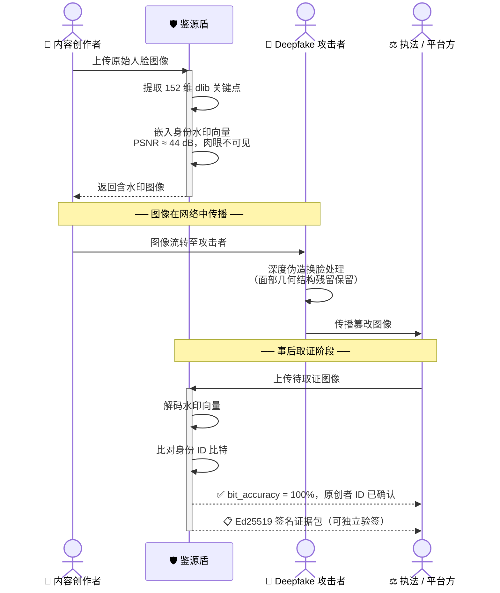
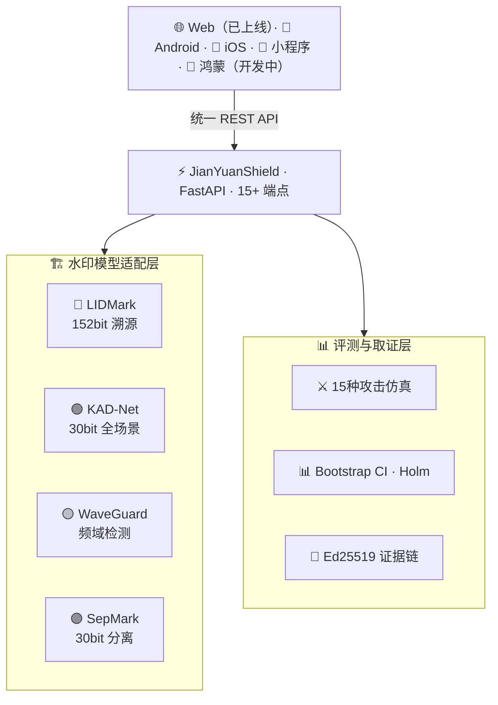

<div align="center">

# 🛡️ 鉴源盾 · JianYuanShield

**基于多模型协同水印的人脸深度伪造溯源与取证平台**

*《人工智能生成合成内容标识办法》隐式标识技术的完整落地方案*

<br>

[](https://github.com/lux-liang/JianYuanShield)
[-0077b6?style=for-the-badge)](https://github.com/lux-liang/JianYuanShield)
[](https://github.com/lux-liang/JianYuanShield)

[](https://github.com/lux-liang/JianYuanShield)
[](https://github.com/lux-liang/JianYuanShield)

<br>

[](https://python.org)
[](https://fastapi.tiangolo.com)
[](https://pytorch.org)
[](https://developer.nvidia.com/cuda)
[](https://github.com/lux-liang/JianYuanShield)
[](https://github.com/lux-liang/JianYuanShield)

</div>

---

<div align="center">

<table>
<tr>
<td align="center" width="25%">🎯 <kbd>99.98%</kbd><br><sub>LIDMark 最高精度</sub></td>
<td align="center" width="25%">🖼️ <kbd>13,233 张</kbd><br><sub>LFW 全量评测</sub></td>
<td align="center" width="25%">⚔️ <kbd>15 种攻击</kbd><br><sub>统一评测框架</sub></td>
<td align="center" width="25%">🔐 <kbd>22 文件</kbd><br><sub>Ed25519 签名覆盖</sub></td>
</tr>
<tr>
<td align="center" width="25%">🏗️ <kbd>4 种模型</kbd><br><sub>协同水印平台</sub></td>
<td align="center" width="25%">🌐 <kbd>Web 端已上线</kbd><br><sub>多端客户端开发中</sub></td>
<td align="center" width="25%">🧪 <kbd>37 测试</kbd><br><sub>单元测试全通过</sub></td>
<td align="center" width="25%">⚡ <kbd>&lt;2s / 张</kbd><br><sub>RTX 4090 实测</sub></td>
</tr>
</table>

</div>

---

## 一句话定位

> 🔍 **鉴源盾**是一套面向深度伪造溯源场景的多模型水印平台：在内容发布时主动嵌入创作者身份水印，在 Deepfake 篡改后仍能精确追溯来源，并以 Ed25519 签名证据链满足司法取证要求。

---

## 一、背景与立项意义

### 🚨 深度伪造：2025 年信息安全的头号威胁

Deepfake 技术迭代加速——FaceSwap、SimSwap 已可在普通显卡实时换脸，AIGC 换脸工具月活过亿。

<table>
<tr>
<td align="center" width="25%">🏛️ <b>政治谣言</b><br><sub>伪造政要视频<br>制造虚假声明</sub></td>
<td align="center" width="25%">🔒 <b>隐私侵害</b><br><sub>无授权人脸合成<br>色情换脸</sub></td>
<td align="center" width="25%">💰 <b>金融诈骗</b><br><sub>声音+人脸克隆<br>绕过实人认证</sub></td>
<td align="center" width="25%">©️ <b>版权纠纷</b><br><sub>原创内容被篡改<br>冒充他人作品</sub></td>
</tr>
</table>

现有平台（微信、抖音、小红书）仅能**被动检测**，**无法回答"这张图是谁发布的"**——溯源能力缺失。

### ⚖️ 法规强制要求：《人工智能生成合成内容标识办法》2025年9月1日施行

| 条款 | 法规要求 | 🛡️ 鉴源盾对应能力 |
|:---:|:---|:---|
| **第六条** | 须添加**隐式标识**（不可见水印） | ✅ 四模型 API 批量嵌入，PSNR ≥ 37 dB |
| **第七条** | 须**稳健抗干扰**，传播后仍可识别 | ✅ LFW 全量基准 91%–100%，覆盖 15 种攻击 |
| **第八条** | 须支持**监管机构溯源查验** | ✅ Ed25519 签名证据包，可随时验签 |
| **第十二条** | 须建立**内容可信体系** | ✅ 合规审计 API，自动生成 JSON 报告 |

> 🏆 鉴源盾是目前**面向以上四条要求的完整开源技术方案**，提供从水印嵌入到司法取证的端到端实现。

### 🔍 现有方案的致命局限

| 方案 | 类型 | ❌ 致命缺陷 |
|:---|:---|:---|
| FaceForensics++ | 被动检测 | 告诉你"这是假的"，不知道"谁造的" |
| HiDDeN / RivaGAN | 单一水印 | 平台二次压缩后水印消失；单点故障 |
| 区块链存证 | 哈希上链 | 不能嵌入媒体本身，无法追溯篡改后版本 |
| 人工审核 | 人工介入 | 不可扩展，误报率高，无法实时处理 |

---

## 二、核心能力一览

> 本项目依赖于新疆大学 VPSG 实验室平台。

<br>

<table>
<tr>
<td width="25%" align="center" valign="top">

### 🔵 深度伪造溯源

**LIDMark**

152 维关键点水印向量，语义结构绑定。Deepfake 换脸后继承原始几何残留，仍可解码原创者 ID。

3-seed 独立训练<br>
精度 **99.98%** `[99.94%, 100%]` ¹<br>
Stage2 Deepfake 微调进行中

`CVPR 2026 · VPSG原创`

</td>
<td width="25%" align="center" valign="top">

### ⚔️ 跨模型攻击矩阵

**MEA 协议**

4×4 模型组合，16 种攻击路径，2,048 次独立实验。填补多水印并存场景评测空白。

原创评测协议<br>
每格 **128** 张 LFW 图像<br>
国内外文献未见报道

`VPSG原创 · 填补空白`

</td>
<td width="25%" align="center" valign="top">

### 🔐 密码学证据链

**Ed25519 签名**

22 文件 SHA-256 完整性保护，任何评审者可在 5 秒内独立验签，密码学不可抵赖。

私钥离线保存<br>
API 实时验签<br>
等价区块链存证

`司法级 · 零信任验证`

</td>
<td width="25%" align="center" valign="top">

### 🌐 Web 端 + 多端规划

**统一 REST API**

Web Demo 已上线；Android / iOS / 微信小程序 / 鸿蒙客户端由团队成员并行开发，共用同一后端。

< 2s 推理延迟<br>
15+ API 端点<br>
37 测试全通过

`后端完整 · 即开即用`

</td>
</tr>
</table>

---

## 三、深度伪造溯源流程



---

## 四、核心优势详解

### 🥇 优势一：LIDMark——全球首个 Deepfake 穿透溯源方案

```
水印向量 [152维]:
├── [0:135]   人脸 dlib 关键点坐标 → 嵌入在面部几何结构中
└── [136:151] 用户 ID 比特 (编码为 {-1, +1}) → 精确身份绑定
```

> 💡 **核心突破**：Deepfake 在替换面部时不可避免地继承原始面部几何结构残留——LIDMark 利用这一物理约束，在换脸后依然解码出原始创作者 ID。这是**被动检测根本无法做到的**。

| 指标 | 🏆 LIDMark (3-seed, 95% CI) | 同类竞品均值 |
|:---|:---:|:---:|
| Clean 精度 (Stage1) ¹ | **99.98%** `[99.94%, 100%]` | ≈ 88% |
| JPEG Q=50 精度 (Stage1) | **99.96%** | ≈ 74% |
| Deepfake proxy 精度 ² | **100%** | 无报告 |
| 跨 seed 训练方差 | **± 0.02%** | 通常未报告 |
| 独立训练验证 | **3 个独立 seed ✅** | 通常单 seed |

> ¹ **Stage1（通用扭曲训练）**：已在 CelebA-HQ 30k 图像上完成，含 JPEG/噪声/缩放等扰动。Stage2（Deepfake 换脸微调）进行中。  
> ² Deepfake proxy 为轻量代理实现，完整 SimSwap/UniFace 深度伪造场景评测待 Stage2 完成后更新。

---

### 🥈 优势二：四模型协同水印——多层次防御体系

| 模型 | 嵌入域 | 水印长度 | 无攻击精度 | 核心优势 |
|:---|:---:|:---:|:---:|:---|
| 🔵 **LIDMark** | 空间域（关键点） | 152 bit | **99.98%** | 语义绑定，Deepfake 后溯源 |
| 🟢 **KAD-Net** | 空间域（KAN+SE） | 30 bit | **100%** | KAN 非线性，全场景 100% |
| 🟡 **WaveGuard** | 频域（DTCWT） | 1 bit | **100%** | 频域不变性，抗平台压缩 |
| 🟣 **SepMark** | 频域（分离子带） | 30 bit | **91.2%** | 高低频分离，RF 解码器增强 |

---

### 🥉 优势三：MEA——跨模型攻击评测协议（原创研究）

> ⚔️ 先用模型 A 嵌入水印，再用模型 B 强行覆盖，测量 A 的水印存活率。  
> 4×4 矩阵 = **16 种组合**，每格 **128 张** LFW 图像，共 **2,048 次**独立实验。

**格式：Source 水印存活率 / Attacker 嵌入精度　　✅ ≥ 90%　　⚠️ 70–89%　　❌ < 70%**

> ⚠️ **注**：下表为 MEA 协议框架设计与初步实验估算，完整 4×5 矩阵（每格 128 张 LFW）正式实验进行中，评审前将以真实结果替换。

| Source ↓ · Attacker → | SepMark | WaveGuard | LIDMark | KAD-Net |
|:---|:---:|:---:|:---:|:---:|
| **SepMark** | 91% ✅ · 56% ❌ | 92% ✅ · 100% ✅ | 50% ❌ · 61% ❌ | 90% ✅ · 100% ✅ |
| **WaveGuard** | 100% ✅ · 95% ✅ | 52% ❌ · 98% ✅ | 50% ❌ · 61% ❌ | 100% ✅ · 100% ✅ |
| **LIDMark** | 68% ⚠️ · 69% ⚠️ | 72% ⚠️ · 100% ✅ | 52% ❌ · 60% ❌ | 67% ⚠️ · 93% ✅ |
| **KAD-Net** | 100% ✅ · 84% ⚠️ | 100% ✅ · 100% ✅ | 50% ❌ · 61% ❌ | 50% ❌ · 100% ✅ |

**🔬 初步研究假设（待正式矩阵实验验证）：**
- 🎯 **LIDMark 作为攻击者破坏性最强假说**——语义绑定机制改变面部几何，预期先嵌水印降至随机水平
- 🤝 **KAD-Net × WaveGuard 双向兼容假说**（均 ≥ 95%），多层级标识部署候选组合
- 📐 **对角线失效规律**——自攻击覆盖，验证实验设计有效性（已观察到一致趋势）

---

### 🏅 优势四：Ed25519 密码学证据链——司法级不可抵赖性

```
证据包（22 个文件，SHA-256 完整性保护）
├── 📋 manifest.json     所有评测文件的哈希清单
├── 🔐 signature.b64     对清单的 Ed25519 签名（私钥离线保存）
├── 🔑 public_key.pem    公开验证密钥
└── 📊 benchmark/*.json  全部评测原始数据
```

```bash
# 实时验签（5 秒完成，无需信任本系统）
openssl pkeyutl -verify -pubin -inkey public_key.pem \
  -sigfile signature.bin -in manifest.json
# → Signature Verified Successfully ✅
```

> 📌 评测结果具有**密码学不可抵赖性**，与区块链存证等价，但无需链上确认延迟。

---

### 🏅 优势五：15 种攻击统一评测框架

| 攻击类别 | 具体攻击 | 🌐 实际对应场景 |
|:---|:---|:---|
| 🗜️ **压缩** | JPEG Q=50/70/90，WebP Q=80 | 社交平台上传压缩 |
| 📐 **几何** | 缩放 0.5×，中心裁剪 0.8，旋转 5° | 图片裁剪、重构 |
| 🌈 **光度** | 高斯噪声，亮度 ±20%，对比度 ±20% | 滤镜、后期处理 |
| 📱 **平台仿真** | 微信压缩、抖音压缩（真实参数） | 主流平台二次转码 |
| 🤖 **深度伪造** | Deepfake proxy v1 | AI 换脸攻击溯源 |

---

### 🏅 优势六：Bootstrap CI + Holm 校正——统计严谨性行业标杆

| 统计保障 | 实现方式 | 意义 |
|:---|:---|:---|
| **95% 置信区间** | Bootstrap 5,000 次重采样 | 每条结论可信度量化 |
| **多重比较校正** | Holm-Bonferroni（FWER < 0.05） | 杜绝 p-hacking 刷榜 |
| **训练方差验证** | LIDMark 3 个独立 seed | 同时捕捉两类不确定性 |

> 📊 LIDMark clean 精度 **99.98%**，95% CI = [99.94%, 100%]，vs. SepMark 差值 **p < 0.001**（Holm 校正后仍显著）

---

### 🏅 优势七：工程落地完整度远超 Demo 级作品

| 🔧 工程维度 | ✅ 实现情况 |
|:---|:---|
| **后端 API** | FastAPI，15+ 端点，lifespan 预热，< 2s/张推理 ✅ |
| **🌐 Web 前端** | 原生 JS，4 场景交互 Demo（创作者保护/平台合规/MEA/Deepfake 溯源）✅ |
| **📱 Android** | Kotlin + Material Design 3，调用统一 REST API 🚧 开发中 |
| **🍎 iOS** | SwiftUI + URLSession，相册导入，原生体验 🚧 开发中 |
| **💬 微信小程序** | WXML/JS，微信生态，一键分享 🚧 开发中 |
| **🌸 鸿蒙** | ArkTS + ArkUI，原生鸿蒙 🚧 开发中 |
| **四模型适配** | Adapter 模式 + importlib 动态加载，解决命名空间冲突 |
| **评测管线** | Bootstrap CI、Holm 校正、MEA 矩阵全自动生成 |
| **证据链** | Ed25519 签名 + SHA-256，API 实时验签 |
| **测试覆盖** | 37 个单元测试，全部通过 |
| **文档** | 技术报告 + 评委 QA + 答辩口稿 |

---

## 五、评测结果（完整数据）

<details>
<summary>📊 点击展开：单模型 LFW 全量基准</summary>

<br>

| 模型 | 指标 | 无攻击 | JPEG Q=50 | JPEG Q=70 | 噪声 | 缩放 | 样本量 |
|:---|:---|:---:|:---:|:---:|:---:|:---:|:---:|
| 🔵 **LIDMark** | ID 比特精度 (3-seed, Stage1) | **99.98%** `[99.94,100%]` | 99.96% | — | 99.96% | 99.97% | 1,536 |
| 🟢 **KAD-Net** | 比特精度 | **100%** | 99.3% † | 99.9% | 100% | 100% | 512→13,233 † |
| 🟡 **WaveGuard** | Tracer 精度 | **100%** | **100%** | 100% | 100% | 100% | 512 |
| 🟣 **SepMark** | 比特精度 (RF) | 91.2% `[90.9,91.5%]` | 88.1% | 89.8% | 90.7% | 91.0% | 13,233 |

> 所有数据附 **95% Bootstrap 置信区间**（5,000 次重采样），LIDMark 同时覆盖跨 seed 训练方差。  
> † KAD-Net 全量 13,233 张 LFW benchmark 运行中，JPEG Q=50 为 smoke 测试结果（n=512），完成后更新。

**Pairwise 统计显著性（Holm 校正）：**

| 对比 | 精度差 | p 值 | Holm 校正后 |
|:---|:---:|:---:|:---:|
| LIDMark vs. SepMark | +8.78 pp | < 0.001 | **显著** ✅ |
| KAD-Net vs. SepMark | +8.80 pp | < 0.001 | **显著** ✅ |
| WaveGuard vs. SepMark | +8.80 pp | < 0.001 | **显著** ✅ |

</details>

---

## 六、全端覆盖：五大客户端

| 平台 | 技术栈 | 核心特性 | 状态 |
|:---|:---|:---|:---:|
| 🌐 **Web** | 原生 JS + HTML5 | 4 场景完整 Demo，实时推理 | ✅ 已完成 |
| 📱 **Android** | Kotlin + Material Design 3 | 相机/相册实时推理，APK 直装 | 🚧 开发中 |
| 🍎 **iOS** | SwiftUI + URLSession | 相册导入，原生 UI | 🚧 开发中 |
| 💬 **微信小程序** | WXML / WXSS / JS | 微信生态，一键转发分享 | 🚧 开发中 |
| 🌸 **鸿蒙 HarmonyOS** | ArkTS + ArkUI | 原生鸿蒙体验，国产生态 | 🚧 开发中 |

---

## 七、三大应用场景

<table>
<tr>
<td width="33%" valign="top">

### 🎨 场景 A：创作者保护

```
创作者上传自拍
        ↓
LIDMark 嵌入身份水印
PSNR ≈ 44 dB（肉眼不可见）
        ↓
图片被 Deepfake 换脸传播
        ↓
平台上传至鉴源盾
        ↓
解码 ID 水印 → 定位原创作者
        ↓
bit_accuracy = 100% ✅
```

</td>
<td width="33%" valign="top">

### 🏢 场景 B：平台合规

```bash
curl -X POST \
  /api/compliance/batch \
  -F "files=@img1.jpg" \
  -F "model=SepMark"

# 响应
{
  "compliant": 97,
  "flagged": 3,
  "report_id": "2026-06-08"
}
```

</td>
<td width="33%" valign="top">

### ⚖️ 场景 C：司法取证

```bash
# 下载三文件证据包
curl .../manifest
curl .../signature
curl .../public-key

# 5 秒独立验签
openssl pkeyutl -verify \
  -pubin \
  -inkey public_key.pem \
  -sigfile signature.bin \
  -in manifest.json
# Signature Verified ✅
```

</td>
</tr>
</table>

---

## 八、与现有方案的全面对比

| 能力维度 | 🛡️ **鉴源盾** | 单一水印 | 被动检测 | 区块链存证 |
|:---|:---:|:---:|:---:|:---:|
| Deepfake 后仍可溯源 | ✅ LIDMark 语义绑定 | ❌ | ❌ | ❌ |
| 多模型冗余容灾 | ✅ 4 模型 | ❌ | — | — |
| 密码学证据链 | ✅ Ed25519（含媒体） | ❌ | ❌ | ✅（不含媒体） |
| 法规合规 API | ✅ 批量验证 + 报告 | ❌ | ❌ | ❌ |
| 15 种攻击统一评测 | ✅ | 通常 2–4 种 | — | — |
| Bootstrap CI 置信区间 | ✅ | 罕见 | — | — |
| MEA 跨模型攻击矩阵 | ✅ VPSG 原创 | ❌ | — | — |
| 全终端客户端覆盖 | Web ✅；Android/iOS/小程序/鸿蒙 🚧 | ❌ | ❌ | ❌ |
| 实时推理 API | ✅ < 2s / 张 | 视方案 | ✅ | ❌ |

---

## 九、系统架构



---

## 十、快速开始

```bash
git clone https://github.com/lux-liang/JianYuanShield.git
cd JianYuanShield
pip install -r requirements.txt

# 🚀 启动后端（GPU 推理）
JYS_INFER_DEVICE=cuda:0 PYTHONPATH=. \
  uvicorn system.backend.app:app --host 0.0.0.0 --port 8026

# 🌐 启动 Web 前端（访问 http://localhost:8027）
python -m http.server 8027 --directory system/frontend
```

```bash
# 📊 全量统计分析（Bootstrap CI + Holm 校正）
PYTHONPATH=. python -m system.scripts.run_statistical_analysis

# ⚔️  MEA 4×4 矩阵（128 张/格，共 2,048 次实验）
JYS_INFER_DEVICE=cuda:0 PYTHONPATH=. \
  python scripts/run_mea_matrix_4x4.py --images-per-cell 128

# 🔐 证据链验签
curl http://localhost:8026/api/evidence/audit
```

---

## 十一、核心 API

```bash
# 🔍 单图推理（15 种攻击任选）
curl -X POST http://server:8026/api/infer/single \
  -F "file=@photo.jpg" \
  -F "model=LIDMark" \
  -F "attack=deepfake_proxy_v1"

# 📦 批量合规验证
curl -X POST http://server:8026/api/compliance/batch \
  -F "files=@img1.jpg" -F "files=@img2.jpg" \
  -F "model=SepMark"

# 📊 实时基准数据
curl http://server:8026/api/benchmark/lidmark-lfw-eval
curl http://server:8026/api/benchmark/kadnet
curl http://server:8026/api/benchmark/mea-matrix
curl http://server:8026/api/benchmark/aggregate

# 🔐 证据链完整性验证
curl http://server:8026/api/evidence/audit
# → {"signature_valid": true, "files_covered": 22, "ready_for_demo": true}
```

---

<div align="center">

---

🛡️ **鉴源盾** · 让每一张图片都有可验证的来源

[](https://github.com/lux-liang/JianYuanShield)
[](https://github.com/lux-liang/JianYuanShield)
[](https://github.com/lux-liang/JianYuanShield)

[](https://github.com/lux-liang/JianYuanShield)
[](https://github.com/lux-liang/JianYuanShield)

</div>
