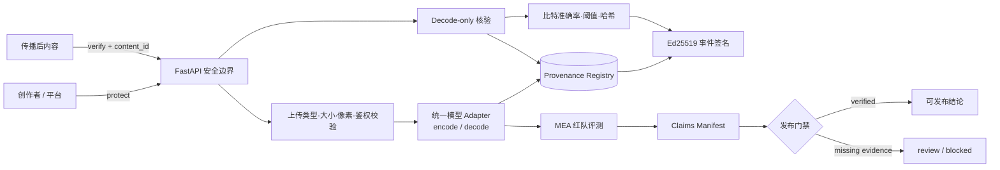

<div align="center">

# 鉴源盾 · JianYuanShield

**面向 Deepfake 传播链的可验证主动溯源与多水印冲突治理平台**

[](configs/claims_manifest.v1.json)
[](configs/evaluation_protocol.v1.json)
[](system/backend/signing.py)
[](.github/workflows/quality.yml)

</div>

## 项目定位

鉴源盾解决的不是“判断一张图片真不真”，而是一个更可追责的问题：

> 内容发布前如何建立来源记录；经历压缩、编辑或二次嵌入后，观测内容能否匹配某条预登记记录及其中由请求方声明的主体引用，并生成可独立验签的技术记录？

系统围绕主动水印构建四段式闭环：

1. **保护**：为内容生成唯一水印消息，绑定请求方声明的应用侧 `creator_ref`。
2. **登记**：记录原始内容、受保护内容和 checkpoint 的 SHA-256，不持久化原始图片。
3. **核验**：对后续收到的图片执行 decode-only，与登记消息比较，不在核验时重新嵌入。
4. **证据**：为登记和核验事件生成 canonical JSON；配置私钥后进行 Ed25519 独立签名。

同时，MEA（Multi-Embedding Attack）协议把“后嵌入水印覆盖先嵌入水印”形式化为红队测试，用来发现多平台、多主体水印共存时的冲突风险。

## 证据验收状态

本仓库采用双门禁，产品演示可用不等于研究结论可发布：

| 门禁 | 验收口径 | 含义 |
|---|---|---|
| 系统能力 | **可执行审计** | API、协议、签名、登记、核验、失败路径与自动测试均进入可审计实现集合 |
| 四模型性能 | **动态 evidence-set 门禁** | `/api/claims` 现场重算 canonical 原始结果、checkpoint、协议、实现哈希、精确成员集合与固定签名者，不在文档中硬编码临时发布状态 |
| 真实 Deepfake | **n256 实验闭包 + 独立签名门禁** | official SimSwap/LFW 身份不重叠轨道已完成 256 对（64 calibration + 192 holdout）严格复算；`deepfake_proxy_v1` 仍仅是局部编辑代理 |
| 法律效力 | **不作承诺** | Ed25519 提供完整性与签名者控制证明，不自动等同司法采信或可信时间戳 |

机器可读状态见 [claims_manifest.v1.json](configs/claims_manifest.v1.json)。`/api/claims` 会检查每条声明的证据文件，并以 fail-closed 方式计算 `ready_for_claims`。

### official SimSwap/LFW n256 holdout

固定协议使用 64 个 calibration pair 选择阈值，以下数字只来自 192 个身份隔离 holdout pair。三类负对照（unwatermarked、wrong-message、cross-record）共享同一批 pair，因此 pooled FAR 仅是描述统计；置信界采用每类负控各 192 pair 的 Wilson 区间。

| 水印模型 | TAR | TAR Wilson 95% 下界 | pooled observed FAR（描述） | 最大单负控 Wilson 95% FAR 上界 |
|---|---:|---:|---:|---:|
| LIDMark | 0.81250000 | 0.75136283 | 136/576 = 0.23611111 | 0.31574692 |
| KAD-Net | **0.99479167** | **0.97109250** | **0/576 = 0.00000000** | **0.01961515** |
| SepMark | 0.94791667 | 0.90679489 | 7/576 = 0.01215278 | 0.05950325 |
| WaveGuard | 0.54687500 | 0.47623085 | 331/576 = 0.57465278 | 0.67559432 |

KAD-Net 的三类负控分别都是 0/192；0.01961515 是每个单控制的 Wilson 95% 上界。pooled 0/576 对应的 0.00662502 仍保留在原始 summary 供复算，但不把三个相关控制表述为 576 次独立试验。

在流程内 ArcFace 迁移子集上，registered-positive 恢复结果由 raw rows 与 pair manifest 动态重算：KAD-Net 在 clean swap 已迁移子集为 160/161（0.99378882，Wilson 95% 下界 0.96566044），在 clean 与 watermarked swap 均迁移子集为 153/154（0.99350649，下界 0.96413879）；SepMark 对应为 151/161（0.93788820，下界 0.88945175）和 150/159（0.94339623，下界 0.89593484）。

同一个固定 ArcFace checkpoint 既向 SimSwap generator 提供 source identity conditioning，也计算 source-vs-target cosine migration；clean swap 在 161/192 holdout pair 上更接近 source（0.83854167，Wilson 95% 下界 0.77994169）。因此这里称为“流程内身份迁移证据”，不是独立身份验证器结论。逐行结果、嵌入、视觉资产、条件分组和实现哈希由 `simswap_lfw_evidence.v1` 重算并进入 release-core。

## 三项核心创新

### 1. 预登记来源记录绑定

`/api/provenance/protect` 不再使用固定或临时丢弃的随机消息，而是：

- 为每份内容生成唯一消息和 `content_id`；
- 将消息与 `creator_ref`、模型、原始/输出/checkpoint 哈希绑定；
- 仅保存受保护图片，默认不保存上传原图；
- 通过 `/api/provenance/verify` 跨请求执行 blind decode 和登记查询；
- 记录精确文件匹配与攻击后比特恢复两种结论。

这使系统可以回答“该内容是否匹配本系统的某条预登记来源记录”。`creator_ref` 是请求方声明的应用侧引用；除非部署另行接入租户、认证会话、对象授权与身份提供方，它不证明自然人身份，也不证明某人亲自发布了内容。

### 2. MEA 多水印冲突红队协议

MEA 测量两项独立指标：

- `first_message_metrics`：二次嵌入后，先嵌水印的保留程度；
- `second_message_metrics`：后嵌水印自身的嵌入成功程度。

协议价值在于暴露冲突与覆盖风险，而不是保证矩阵结果都高。不同消息长度和 decoder 语义必须分开解释，未经证据门禁放行的矩阵数字不进入 README。

部署选择不把 256 张图像误当作 256 个独立身份：正式策略从逐图证据重建 217 个 LFW 身份簇，身份内求均值、身份间等权，再用固定 seed 的 20,000 次 cluster bootstrap 和覆盖 `4×4×6=96` 项的单侧 Bonferroni 选择族计算同时下界。16/30/128/30 bit 的原始准确率只作诊断，跨模型排序使用各模型协议阈值归一化 margin、协议成功率与攻击后质量的聚类下界。

### 3. Claim-as-Code 声明—证据门禁

每条参赛声明都应绑定：模型、checkpoint 哈希、数据清单、样本量、seed、指标语义、攻击、协议版本与原始 artifact。缺少任一关键证据时，系统将声明标记为 `review_required` 或 `blocked`，前端与报告不得展示为已验证结论。

这一机制把“科研诚信检查”变成可执行的安全控制，而不是答辩前人工核对表格。

## 系统架构



## API 语义

| 接口 | 用途 | 可用于正式结论 |
|---|---|---|
| `POST /api/provenance/protect` | 唯一消息嵌入、来源登记、事件签名 | 仅 checkpoint 清单审核且事件已签名时可以 |
| `POST /api/provenance/verify` | decode-only、登记匹配、核验事件签名 | 仅 checkpoint 清单审核且事件已签名时可以 |
| `GET /api/provenance/records/{id}` | 查询来源登记记录 | 可以，受 API Key 保护 |
| `POST /api/infer/single` | 嵌入—攻击—恢复的单样本能力演示 | 不可以；该接口固定 `claim_valid=false` |
| `POST /api/compliance/batch` | 盲检接口能力状态 | 当前返回 `capability_unavailable`，不制造合规率 |
| `GET /api/claims` | 机器可读声明门禁 | 可以 |
| `GET /api/evidence/audit` | artifact、签名、协议和声明综合门禁 | 可以 |
| `GET /api/health` | 运行状态与安全配置摘要 | 仅运维用途 |

未知模型、缺失 checkpoint、无效图片和未配置的生产鉴权都会显式失败。模拟结果携带 `claim_valid=false`，不得用于合规、溯源或科研性能声明。

## 安全设计

- JPEG/PNG/WebP 类型与文件内容双重校验；
- 默认单图 5 MiB、1600 万像素、批量 16 张上限；
- GPU 推理默认单并发并设超时；
- 生产模式自动要求 `X-API-Key`；
- CORS 默认仅允许本机 Web 端，禁止通配来源携带凭据；
- 样本和任务标识采用严格字符白名单，阻断路径穿越；
- checkpoint 使用 `weights_only=True` 和严格 state-dict 加载；
- 正式来源声明还要求 checkpoint SHA-256 出现在部署方审核的 `WEIGHT_MANIFEST.json` 中；
- 动态来源记录使用 SQLite 参数化查询；
- 原始上传字节只计算哈希，不进入来源资产目录；
- 单样本推理不落盘原图，衍生任务工件默认 1 小时后清理；
- 容器以非 root 用户运行，drop capabilities，并设置 PID 上限。

这些控制是竞赛原型的安全基线。正式部署使用内置速率限制与写入磁盘准入，并由反向代理完成 TLS；平台级身份、对象级授权、可信时间戳、外部公钥信任锚和数据生命周期策略由部署环境统一实施。

## 快速开始

### 本机演示模式（非发布路径）

```bash
docker compose config --quiet
docker compose up --build
```

- Web：`http://127.0.0.1:8027`
- API：`http://127.0.0.1:8026`
- OpenAPI：`http://127.0.0.1:8026/docs`

该 Compose 仅用于回环地址上的本机 UI/API 联调。无模型权重时系统仍可启动并展示协议、门禁和 UI 流程，但模型结果明确标记为 simulation。基础 Compose 不会擅自创建或挂载宿主模型目录。需要在本机联调真实模型时，先核验源码与 checkpoint，再显式配置并启动：

```bash
export JYS_WEIGHT_HOST=/absolute/path/to/verified/weights
export JYS_MODEL_SOURCE_HOST=/absolute/path/to/reviewed/model-sources
docker compose -f docker-compose.yml -f docker-compose.models.yml up --build
```

两个宿主目录均以只读方式挂载；路径未配置或不存在时，Compose 会直接失败。

正式证据模式还需参考 `configs/weight_manifest.example.json`，在权重根目录创建 `WEIGHT_MANIFEST.json`，为每个获准 checkpoint 填写真实 SHA-256、源码 revision、审核人和审核时间。来源匹配阈值必须由身份隔离的 calibration/holdout、登记回环/无水印/错误消息三类对照 artifact 支撑；系统会从逐样本行重算覆盖、选阈、FAR/FRR 和 Wilson 区间。签名 evidence bundle 必须覆盖 weight manifest、其 checkpoint 与校准 artifact。部署还需通过密钥管理系统注入至少 32 字符的 `JYS_PROVENANCE_SECRET`，并用 `JYS_EVIDENCE_PUBLIC_KEY_FINGERPRINT` 独立固定签名私钥对应的 Ed25519 公钥指纹；仅有文件、任意哈希或任意自签名密钥都不会放行 `claim_valid`。

### 正式发布与生产部署

联网生产路径使用 [docker-compose.production.yml](docker-compose.production.yml)；国赛断网路径只使用 [docker-compose.competition.yml](docker-compose.competition.yml)、[build_release_image.py](scripts/build_release_image.py) 和 [offline_deploy.sh](offline_deploy.sh)。先提交全部已审查变更，确保工作区干净，再以当前完整 Git commit 作为镜像 tag。构建脚本会读取 BuildKit image-manifest/config digest，并为断网发布同时导出：保留最大级别 SLSA provenance 与 SPDX SBOM attestation 的 OCI archive，以及按同一 config digest 固定、可由 `docker load` 恢复的 companion archive。

```bash
python3 scripts/supply_chain.py check
python3 scripts/check_deployment.py

RELEASE_COMMIT="$(git rev-parse HEAD)"
python3 scripts/build_release_image.py \
  --image "ghcr.io/lux-liang/jianyuanshield:${RELEASE_COMMIT}" \
  --push
```

将脚本输出的 `repository@sha256:...` 写入 `JYS_RELEASE_IMAGE`。三个秘密必须由部署机的 secret manager 落为权限受控的普通文件；Compose 只挂载文件，不接受明文秘密环境变量：

```bash
export JYS_RELEASE_IMAGE='ghcr.io/lux-liang/jianyuanshield@sha256:<verified-digest>'
export JYS_WEIGHT_HOST='/absolute/path/to/verified/weights'
export JYS_MODEL_SOURCE_HOST='/absolute/path/to/reviewed/model-sources'
export JYS_API_KEY_SECRET_FILE='/secure/path/jys_api_key'
export JYS_PROVENANCE_SECRET_FILE='/secure/path/jys_provenance_secret'
export JYS_EVIDENCE_PRIVATE_KEY_FILE='/secure/path/jys_ed25519.pem'
export JYS_EVIDENCE_PUBLIC_KEY_FINGERPRINT='<reviewed-64-char-sha256-fingerprint>'
export JYS_CORS_ORIGINS='https://console.example'

docker compose -f docker-compose.production.yml config --quiet
docker compose -f docker-compose.production.yml up -d --no-build
```

API Key 和来源派生秘密均至少 32 个随机字符；签名公钥指纹通过独立可信通道核对。生产 Compose 强制关闭 demo 与 API schema，镜像按 digest 固定，模型目录只读，根文件系统只读，端口默认仅绑定 `127.0.0.1`。内置最小 gateway 在 8027 提供静态控制台，只把同源 `/api` 与 `/api/*` 转发给固定内部服务 `api:8026`；它丢弃浏览器提交的 `X-API-Key` 并从 Docker secret 服务端注入，不支持开放代理、目录遍历或静态目录列表。长期 API Key 不进入 JavaScript、LocalStorage 或响应。公网场景仍应在 8027 前部署完成用户会话与对象授权的 TLS 入口。不要把 API Key、来源秘密、签名私钥或 GitHub token 写入仓库、镜像、`.env` 或命令历史。

### 国赛断网 bundle

先在干净且已签署 release-core 的发布机上生成双归档和发布记录；两个输出来自同一次 BuildKit 构建：

```bash
RELEASE_COMMIT="$(git rev-parse HEAD)"
python3 scripts/build_release_image.py \
  --image "ghcr.io/lux-liang/jianyuanshield:${RELEASE_COMMIT}" \
  --artifact-dir dist/competition-image \
  --oci-output dist/competition-image/release-image.oci.tar \
  --load-output dist/competition-image/release-image.docker.tar

bash offline_deploy.sh create \
  --output /srv/releases/JianYuanShield-competition \
  --runtime-root /absolute/path/to/JianYuanShield-runtime \
  --release-dir dist/competition-image \
  --signing-key /secure/evidence-ed25519.pem \
  --signer-fingerprint '<登记的 64 位 SHA-256>'
```

`create` 要求 Git commit/tree 与镜像记录一致、工作区干净、release-core 由外部钉扎 signer 验证通过，并在复制前检查可用磁盘。输出包含镜像双归档、BuildKit metadata、CycloneDX、签名 evidence、正式 reports/assets、权重、模型源码、数据和第三方许可证；不复制 API key、provenance secret 或任何私钥。bundle manifest 精确列出每个普通文件并由同一 Ed25519 key 签名，`SHA256SUMS` 提供现场逐文件复算。

现场秘密目录固定包含 `api_key`、`provenance_secret`、`evidence_ed25519.pem`，三者权限均为 `0600`，前两个值至少 32 字符。先独立验签，再用一个从未存在的新状态目录单命令恢复：

```bash
export JYS_BUNDLE=/media/readonly/JianYuanShield-competition
export JYS_SIGNER_FINGERPRINT='<登记的 64 位 SHA-256>'

bash "$JYS_BUNDLE/deployment/offline_deploy.sh" preflight \
  --bundle "$JYS_BUNDLE" \
  --signer-fingerprint "$JYS_SIGNER_FINGERPRINT"

bash "$JYS_BUNDLE/deployment/offline_deploy.sh" restore \
  --bundle "$JYS_BUNDLE" \
  --signer-fingerprint "$JYS_SIGNER_FINGERPRINT" \
  --secret-dir /secure/jys-competition-secrets \
  --state-dir /var/tmp/jys-competition-session
```

`restore` 会再次完成全量 preflight、`docker load`、config-digest image ID 核验、CUDA 实机检查、Compose fail-closed 渲染和健康等待，然后只在 `127.0.0.1:8027` 发布同源控制台。weights/model-sources/data/reports 均只读；assets、provenance state、独立 audit anchor 使用三个新的 project-scoped 卷。只提供 `create`、`preflight`、`restore`、`status`、`stop` 五个正式子命令，不存在 dev/simulation 回退。

### 本地测试

```bash
python3 -m unittest discover -s tests -v
python3 scripts/check_system.py
python3 scripts/check_documentation.py
python3 scripts/supply_chain.py check
python3 scripts/check_deployment.py
```

`requirements.txt` 表达维护区间；Linux x86-64、CPython 3.11、CUDA 12.8 的正式构建只安装带完整 distribution SHA-256 的 `requirements.lock`。确定性 CycloneDX 清单位于 `supply-chain/python-dependencies.cdx.json`，基础镜像、APT snapshot、输入哈希和 SBOM 哈希位于 `supply-chain/build-manifest.json`；任一输入变化而未重生成时，CI 与镜像构建均 fail closed。

## 来源保护示例

```bash
curl -X POST http://127.0.0.1:8026/api/provenance/protect \
  -H "X-API-Key: $JYS_API_KEY" \
  -F "file=@portrait.png;type=image/png" \
  -F "creator_ref=creator-001" \
  -F "model=LIDMark"
```

返回的 `content_id` 用于后续核验：

```bash
curl -X POST http://127.0.0.1:8026/api/provenance/verify \
  -H "X-API-Key: $JYS_API_KEY" \
  -F "file=@received.png;type=image/png" \
  -F "content_id=<protect 返回值>"
```

`verified=true` 表示恢复消息达到协议阈值，并匹配指定登记记录；只有权重清单审核、正负样本阈值校准 artifact、事件签名验签和独立固定的签名公钥指纹也全部成功时 `claim_valid=true`。两者都不表示图片“真实”、未被编辑，或满足任何司法采信标准。

## 正式实验最低要求

任何进入答辩主结论的实验必须同时具备：

1. 合法数据来源与不可变 dataset manifest；
2. 身份不重叠的训练/验证/测试划分；
3. checkpoint、代码提交和协议 SHA-256；
4. 原始逐图结果，而非仅汇总表；
5. 无水印负样本、错误 ID、未知主体和篡改失败路径；
6. FAR、FRR、ROC/阈值校准，以及恰当的置信区间；
7. detector、tracer、ID bit、landmark 指标分表报告；
8. seed 作为层级处理，不把同一批图片的多 seed 结果伪装成独立样本；
9. 真实换脸模型与 proxy 结果严格分开；
10. 由 `claims_manifest` 和 Ed25519 evidence bundle 自动放行。

## 当前限制与路线

- 大体积模型权重、数据集和正式结果位于独立 runtime evidence roots；release manifest 以 logical path、SHA-256、精确成员集合和固定签名者把它们与代码快照闭包绑定，运行时门禁据此即时决定主张是否可发布。
- `deepfake_proxy_v1` 只用于传播管线 smoke；真实人脸交换结论只读取独立的 official SimSwap/LFW n256 评测轨道、流程内 ArcFace 迁移证据、四类对照与签名门禁；ArcFace 不作为独立身份验证器。
- 合规批检在 blind detector 完成负样本校准前保持不可用。
- SQLite 适合单机竞赛原型；平台部署应迁移到带审计和对象权限的数据库。
- Ed25519 当前解决完整性与签名问题；可信时间、密钥托管和法律程序需外部基础设施。
- Android、Web、小程序需要统一接入 provenance API，并对 simulation 状态做不可移除标识。

实验资源、阶段命令和证据产物统一见 [EXPERIMENT_EXECUTION.md](docs/EXPERIMENT_EXECUTION.md)；安全威胁、现有控制与剩余风险见 [THREAT_MODEL.md](docs/THREAT_MODEL.md)，详细能力边界见 [LIMITATIONS.md](docs/LIMITATIONS.md)，评审口径见 [README_COMPETITION.md](README_COMPETITION.md)。

## 贡献与成果归属

鉴源盾统一集成多种团队研究候选模型与评测组件。正式参赛材料应为每个模型单独提供作者、指导教师既有成果/本届新增工作、许可证、训练日志和提交记录，避免把“平台集成贡献”与“底层算法原创贡献”混为一谈。

---

**项目原则：宁可把未完成项标成 blocked，也不让一次不可复核的满分数字损害整套作品的可信度。**
