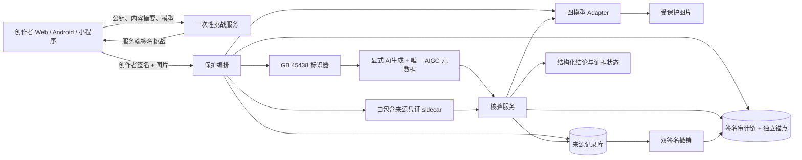
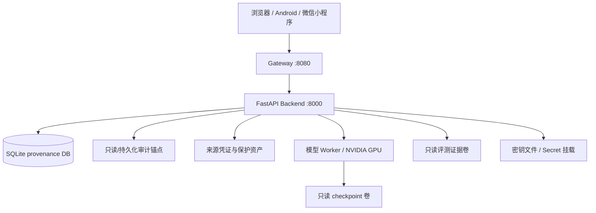

# 鉴源盾（JianYuanShield）技术报告

> 面向 AI 生成合成图像的主动溯源、可信凭证与对抗评测系统
> 项目组：VPSG Team　仓库：`lux-liang/JianYuanShield`
> 文档基线：2026-08-04　证据协议：`evaluation_protocol.v1`

## 摘要

鉴源盾面向 AI 生成合成图像在发布、平台转码、二次编辑和换脸传播中出现的“来源凭证丢失、声明不可验证、标识易被篡改、评测难以复算”问题，构建“创作者持钥证明—主动水印保护—GB 45438-2025 双重标识—签名来源凭证—传播后核验—撤销与审计”的端到端闭环。系统把 LIDMark、KAD-Net、SepMark、WaveGuard 四类异构水印模型纳入统一 adapter 与版本化协议，并提出 MEA（Multi-Embedding Attack）4×4 多重嵌入红队矩阵和基于身份聚类同步置信界的协同部署策略。

项目的核心创新不是把若干模型简单拼接为页面，而是把“身份、内容、模型、权重、实现、评测、声明和撤销”置于同一条可验证证据链：创作者通过一次性 Ed25519 挑战证明密钥占有；服务端签发自包含来源凭证；图片显式标识和唯一 `AIGC` 元数据与内容编号绑定；SQLite 事件链逐项哈希并签名，独立锚点检测尾部删除和数据库回滚；`claims_manifest.v1.json` 约束每项声明，模型结论只有在原始逐图结果、checkpoint、代码哈希、协议覆盖、签名者指纹和 release-core 成员同时通过门禁后才可发布。系统不发布模型准确率的门禁外泛化或领先性结论。

固定 LFW 全量协议已完成 KAD-Net 与 SepMark 各 13,233 张 × 15 攻击（各 198,495 行、0 错误），LIDMark 身份隔离测试完成 1,324 张 × 15 攻击（19,860 行、0 错误），WaveGuard 同协议全量运行由可恢复进度与晋级门禁管理。official SimSwap/ArcFace/LFW n=256 实验完成 256 个身份不重叠 pair、1,024 条模型结果、1,792 条身份嵌入和 176 个视觉资产；KAD-Net 在 192 个身份隔离 holdout pair 上获得 0.99479167 TAR，三类负控分别为 0/192。所有数字均保留原始行、输入清单、运行配置、实现哈希和条件化身份迁移统计，不把流程内 ArcFace 验证写成独立第三方鉴定。

## 1. 赛题问题与设计目标

### 1.1 问题定义

对内容 $x$，创作者希望在发布前建立一个以后可核验的来源关系。平台传播会施加压缩、缩放、重编码、亮度变化或裁剪；攻击者还可能换脸、覆盖另一水印、替换元数据或删除登记记录。鉴源盾解决的不是对任意未知图片作开放世界“真/假”分类，而是回答三个可证问题：

1. 当前持钥者是否参与了这次保护登记？
2. 当前图片是否恢复出与登记记录一致的主动水印凭证？
3. 登记、核验与撤销历史是否保持完整，结论是否来自受信证据版本？

### 1.2 系统目标

| 目标 | 可验收定义 |
|---|---|
| 身份可证 | 创作者 Ed25519 私钥对服务端一次性挑战签名；挑战绑定内容哈希、模型和 owner scope |
| 内容可追 | 受保护图片、`content_id`、消息、模型、checkpoint 与创建事件形成签名记录 |
| 标识可检 | PNG 仅有一个 `AIGC` 元数据项，并叠加满足图像显式标识尺寸要求的“AI生成”标识 |
| 传播可核 | 无需原始文件字节完全一致，仍可通过模型恢复值与登记阈值判定 |
| 历史可审 | 事件采用序号、前驱哈希、事件哈希和 Ed25519 签名；独立锚点约束链尾 |
| 权利可撤 | 撤销意图同时要求创作者签名与服务端签名，且一次性消费、不可重放 |
| 实验可复算 | 原始逐图 CSV、数据 manifest、配置、权重、代码、环境和签名证据完整 |
| 声明可约束 | 页面与 API 从动态 claim gate 读取状态，不把“服务可运行”替代“结论已验证” |

## 2. 总体架构

### 2.1 逻辑架构



### 2.2 工程分层

| 层 | 主要职责 | 实现位置 |
|---|---|---|
| 客户端 | 持钥、挑战签名、上传、结果语义与撤销交互 | `system/frontend/`、`android/`、`miniprogram/` |
| 网关 | 静态页面、API 转发、限流、安全头、健康探针 | `system/gateway.py` |
| API | 参数校验、鉴权、并发控制、统一错误语义 | `system/backend/routes.py`、`security.py` |
| 来源协议 | 挑战、保护、凭证、核验、撤销 | `creator_identity.py`、`provenance.py` |
| 合规标识 | 显式标识、AIGC 元数据、生产者签名 | `aigc_labeling.py` |
| 审计 | 追加事件链、签名锚点、回滚检测 | `audit_ledger.py` |
| 模型运行时 | 模型注册、权重校验、单 GPU 信号量、超时 | `runtime.py`、`model_adapters.py` |
| 评测 | 固定协议、攻击适配、统计、晋级、证据捕获 | `system/evaluation/`、`system/scripts/` |
| 声明与供应链 | claim gate、release-core、SBOM、离线包签名 | `claims.py`、`signing.py`、`scripts/supply_chain.py` |

### 2.3 典型部署拓扑



竞赛部署由 `docker-compose.competition.yml` 固化容器、健康检查、只读挂载和网络边界；模型权重与基础镜像可通过离线 bundle 携带，避免赛场网络依赖。

## 3. 端到端来源协议

### 3.1 创作者密钥与一次性挑战

客户端生成 Ed25519 密钥对，私钥保留在客户端安全存储中。挑战请求提交：

```text
creator_public_key
creator_ref
model
SHA256(input image)
```

服务端生成 `challenge_id`、随机 nonce、过期时间，并对完整挑战作服务端签名。客户端只对服务端返回的 canonical signing message 签名。消费时同时验证：

$$
\mathrm{Verify}_{K_c^{pub}}(m_{challenge},\sigma_c)=1
$$

且挑战必须未过期、未使用，并与这次上传的内容哈希和模型完全一致。服务端以 `ed25519:<public-key-fingerprint>` 派生不可伪造的 `owner_scope`；成功后挑战被原子消费，重放返回失败。`creator_identity` 保存公钥、指纹、签名和挑战摘要，不保存私钥。

### 3.2 主动水印保护

不同模型的消息长度和解码语义不同，系统不使用一个固定数组冒充统一消息。设模型 $i$ 的消息空间为 $\{0,1\}^{L_i}$，通过 adapter 执行：

$$
y=E_i(x,m_i;\theta_i)
$$

登记记录至少绑定：

```text
content_id, protocol_version, creator_identity, owner_scope
model, message_bits, source_sha256, protected_sha256
checkpoint_path, checkpoint_sha256, implementation_sha256
created_at, server_record_signature
```

消息在服务端由安全随机源产生，并与登记记录绑定；它不是对创作者身份的替代证明，身份关系由上一节的持钥挑战提供。

### 3.3 GB 45438-2025 双重标识

对于标记为 AI 生成合成内容的输出，系统同时加入：

- 显式标识：右下角矢量绘制“AI生成”，标识文字/字形高度按图像短边 6% 生成，高于标准对图片文字高度不小于短边 5% 的要求；
- 隐式标识：PNG 文本元数据中恰好一个 `AIGC` 扩展字段，写入标准规定的 `Label`、`ContentProducer`、`ProduceID`、`ContentPropagator`、`PropagateID` 和保留字段；
- 完整性封印：`ReservedCode1` 写入 `JYS1` 版本化 Ed25519 封印，绑定 AIGC 核心字段、内容编号、生产者密钥指纹和签名。

首次生产时 `ContentProducer=ContentPropagator`，`ProduceID=PropagateID=content_id`。检查器拒绝重复 `AIGC` 块、编号错配、字段非法、元数据篡改或生产者签名失败。

该实现对齐 [GB 45438-2025《网络安全技术 人工智能生成合成内容标识方法》](https://openstd.samr.gov.cn/bzgk/std/newGbInfo?hcno=F32EA2A561F1886CD8D606513512D547) 的图像标识技术字段，并落实《人工智能生成合成内容标识办法》关于显式与隐式标识的组合要求。

### 3.4 自包含来源凭证

保护成功后生成 `source-credential.json`，其中包含：

- 来源记录的核心字段和记录签名；
- 创作者持钥证明；
- 创建审计事件与当前链锚；
- AIGC 标识摘要；
- 撤销状态；
- 服务端对整个 sidecar 的 detached signature。

核验端可用三种定位方式：显式 `content_id`、上传 sidecar、从图片 `AIGC` 元数据读取。多种定位器同时出现时必须一致；sidecar 与数据库记录不一致、签名无效或内容编号冲突均拒绝产生可信声明。

### 3.5 传播后核验

对传播后图像 $y'$，adapter 恢复 $\hat m=D_i(y';\theta_i)$。消息恢复分数为：

$$
s(m,\hat m)=1-\frac{1}{L_i}\sum_{j=1}^{L_i}\mathbf{1}[m_j\neq\hat m_j]
$$

版本化阈值 $\tau_i$ 来自固定 calibration 数据而不是请求时调参：

$$
\mathrm{verified}=\mathbf{1}[s(m,\hat m)\ge\tau_i]
$$

API 分离四类语义：

| 字段 | 含义 |
|---|---|
| `exact_protected_file_match` | 当前输入字节是否与登记输出完全相同 |
| `verified` | 主动水印恢复是否达到登记阈值 |
| `metadata_integrity` | AIGC 元数据、编号和生产者封印是否完整 |
| `claim_valid` | 记录未撤销且身份、模型证据、签名、审计和门禁均可信 |

因此 JPEG 转码后可出现“字节不相同但水印核验通过”；撤销后也可保留历史 `verified=true`，同时强制 `claim_valid=false`，避免抹除历史技术事实。

### 3.6 双签名撤销

撤销分两步：

1. 服务端签发绑定 `content_id`、原因、创作者公钥和过期时间的一次性撤销意图；
2. 创作者私钥签名后提交，服务端验证并原子消费该意图。

支持 `creator_request`、`key_compromise`、`mislabeling`、`policy_violation` 四种版本化原因。撤销事件写入来源数据库和签名审计链，sidecar 同步刷新；同一意图不能重放。

## 4. 防回滚审计链

### 4.1 事件结构

第 $n$ 个事件的规范化正文为 $e_n$，前驱哈希为 $h_{n-1}$：

$$
h_n=\mathrm{SHA256}(\mathrm{CanonicalJSON}(n,h_{n-1},e_n))
$$

并生成：

$$
\sigma_n=\mathrm{Ed25519.Sign}_{K_s^{priv}}(h_n)
$$

每个事件同时保存 `sequence`、`prev_hash`、`event_hash`、签名和签名者公钥指纹。独立 anchor 文件保存最新序号与链尾哈希并由服务端密钥签名。

### 4.2 可检测故障

| 故障 | 检测机制 |
|---|---|
| 中间行修改/替换 | 事件哈希与签名失败 |
| 中间行删除/重排 | sequence 与前驱哈希断裂 |
| 尾部删除 | 数据库链尾落后于受信 anchor |
| 整库回滚 | anchor 序号/哈希与数据库不一致 |
| anchor 替换 | anchor 签名或固定公钥指纹失败 |
| 写库成功、锚更新前崩溃 | 数据库只领先一个受签事件时执行可信恢复 |

生产模式要求受信 anchor；开发模式仍执行完整结构校验，但不会把未固定的本地锚包装成外部信任。

## 5. 四模型统一运行时

### 5.1 Adapter 合同

所有模型实现统一接口：

```python
encode(image, message) -> protected_image
decode(image) -> model_specific_scores
health() -> checkpoint/runtime/evidence status
```

统一接口只统一生命周期、错误语义和证据字段，不抹平模型原始语义：

| 模型 | 消息长度 | 正式主指标 | 关键特性 |
|---|---:|---|---|
| LIDMark | 16 | bit accuracy + identity exact match | 联合水印与人脸关键点/身份字段 |
| KAD-Net | 30 | bit accuracy / threshold success | 高频鲁棒主动水印 |
| SepMark | 128 | decoder C bit accuracy | 双解码路径，正式口径固定 decoder C |
| WaveGuard | 30 | tracer bit accuracy | detector/tracer 语义分离 |

不同消息长度、decoder 和阈值下的原始 bit accuracy 不直接合并为“总榜”；跨模型策略先按各自登记阈值归一化，再在同一图片和同一攻击单元上比较。

### 5.2 权重与生命周期控制

- checkpoint 路径必须属于允许目录，并与审核权重清单 SHA-256 一致；
- 加载优先使用 `weights_only=True` 和严格 state dict；
- runtime 缓存同时绑定 checkpoint 哈希，权重漂移后旧缓存不再产生正式结论；
- CPU/GPU 设备、模型就绪、证据就绪和 claim gate 分开报告；
- 单 GPU semaphore 限制显存竞争，耗时推理在线程池执行并有超时；
- 模型不可用返回能力错误，不退化为随机或模拟结论。

## 6. MEA 多重嵌入红队与协同策略

### 6.1 攻击定义

来源模型 $A$ 先嵌入消息 $m_A$，攻击模型 $B$ 再嵌入不同消息 $m_B$：

$$
x_A=E_A(x,m_A),\quad x_{AB}=E_B(x_A,m_B)
$$

分别计算来源消息保留 $D_A(x_{AB})$、攻击消息成功 $D_B(x_{AB})$ 和两次图像损失。4 个来源模型 × 4 个攻击模型形成 16 个方向性 cell；$A\rightarrow B$ 与 $B\rightarrow A$ 不视为同一实验。

### 6.2 固定证据矩阵

正式矩阵使用 256 张图片、每 cell 256 行，共 4,096 行；16/16 cell 完整，缺失、重复、意外和错误行均为 0，运行耗时 507.68 秒。每行绑定原图、来源输出、二次嵌入输出、两模型消息、checkpoint 与实现版本。

### 6.3 身份聚类同步推断

256 张实验图片属于 217 个身份，其中 24 个身份重复、涉及 63 张图片、最大身份簇为 10；同一身份内样本并非独立。策略 v2 以身份为重采样单元，而非把 4,096 行或 256 张图片当成互相独立的 Bernoulli 试验：

1. 用固定的 LFW 文件名身份前缀规则构造 217 个 cluster，先在身份内求图像均值，再对身份等权；
2. 登记每个模型的 16/30/128/30 bit、主 decoder 与成功阈值，将各自阈值单调映射到归一化 margin 的 0.5；原始 bit accuracy 仅作诊断；
3. 以 `numpy PCG64`、seed `20260603` 执行 20,000 次确定性 identity-cluster bootstrap；
4. 对来源/攻击者归一化 margin 与协议成功率、攻击后 PSNR/SSIM 构造 `4×4×6=96` 项固定单侧 Bonferroni 同步置信族，覆盖候选选择和选择后报告；
5. 只有满足来源归一化 margin、协议成功率、攻击后画质和证据完整性全部硬约束的模型才进入 Pareto 部署候选。

策略输出不是静态“推荐卡片”，而是由 API 对签名原始矩阵、身份映射、策略配置和同步界实时复算；响应同时给出选择稳定率与旧 i.i.d. / 新 cluster 消融。交互分类只产生明确标为 `planned_*` 的 policy hint，不声称已自动执行双来源登记或双水印。任一哈希或身份簇审计变化即拒绝推荐。

## 7. 合规与安全设计

### 7.1 标识规范对齐

《人工智能生成合成内容标识办法》明确生成合成内容标识包含显式和隐式标识，要求图片适当位置添加显著提示、元数据写入属性/服务提供者/内容编号，并自 2025-09-01 施行。鉴源盾将这些要求落实为可自动测试的二进制产物合同，而不是仅在 UI 展示一段声明：

| 要求 | 系统控制 | 自动检测 |
|---|---|---|
| 图片显式标识 | 右下角“AI生成”，尺寸按短边 6% | 像素位置与尺寸门禁 |
| 唯一隐式标识 | PNG 中恰好一个 `AIGC` 扩展字段 | 重复/缺失块拒绝 |
| 制作主体与编号 | Producer/Propagator、ProduceID/PropagateID | 结构和 ID 一致性校验 |
| 标识防篡改 | ReservedCode1 内 Ed25519 封印 | 固定指纹与签名验证 |
| 标识不可恶意删除 | 检查器报告缺失，sidecar/审计链保留证据 | 元数据移除测试 |

### 7.2 API 与基础设施控制

| 风险 | 控制 |
|---|---|
| 超大/伪造图片 | MIME + magic、字节上限、像素上限、批量上限 |
| 解压炸弹 | 解码前后尺寸限制，拒绝异常图片 |
| 匿名高成本调用 | 生产模式 API key fail-closed，常量时间比较 |
| 跨站滥用 | 精确 CORS allowlist，默认不携带 credentials |
| 路径穿越 | ID 白名单、解析后根目录约束、参数化数据库 |
| GPU 拥塞 | semaphore、线程池、超时和健康状态 |
| checkpoint RCE/错配 | 审核路径、SHA-256 清单、严格加载、只读挂载 |
| 容器提权 | 非 root、drop capabilities、`no-new-privileges` |
| 密钥泄漏 | secret 文件挂载、环境变量长度校验、不写入镜像和日志 |
| 结论越权 | `ready_for_demo`、`verified`、`claim_valid` 三状态分离 |
| 证据替换 | release-core 精确成员、Ed25519 manifest、固定签名者指纹 |

完整威胁边界和滥用案例见 [THREAT_MODEL.md](THREAT_MODEL.md)。

## 8. 评测方法

### 8.1 固定协议

`configs/evaluation_protocol.v1.json` 是攻击语义的唯一来源。正式运行必须记录：

- 输入数据 manifest、文件 SHA-256 与身份划分；
- 攻击 ID、参数和确定性 seed；
- checkpoint、源代码、协议、Python/框架/CUDA/驱动哈希或版本；
- 原始逐图 CSV，而非只有平均值；
- 正例、无水印、错误消息、跨记录等负控；
- calibration 与 holdout 身份隔离；
- Wilson 95% 区间或以身份为单位的 cluster bootstrap；
- 运行前后输入审计、覆盖率、重复行、错误行和晋级结果。

15 种固定攻击为：clean、JPEG 50/70/90、0.5× 缩放、高斯噪声 $\sigma=3$、中心裁剪 0.8、旋转 5°、高斯模糊 5、亮度 0.85、对比度 1.2、WebP 50、微信转码代理、抖音转码代理和 deepfake proxy。平台项是版本化可复算代理变换，不冒充真实平台黑盒采样。

### 8.2 成功率与置信区间

每个模型的 success threshold 在协议中固定。比例 $\hat p=k/n$ 使用 Wilson 95% 区间：

$$
\frac{\hat p+z^2/(2n)\pm z\sqrt{\hat p(1-\hat p)/n+z^2/(4n^2)}}{1+z^2/n},\quad z=1.96
$$

当多个负控共享同一图片/pair 时，不将 pooled 行错误称为独立试验；正式上界按每类控制分别报告。MEA 则进一步按身份 cluster 同步重采样。

## 9. 实验结果

### 9.1 LFW 固定攻击全量实验

KAD-Net 与 SepMark 均覆盖 LFW 13,233 张图片和 15 种攻击，每个模型 198,495 条结果、0 错误。LIDMark 使用身份隔离测试集 1,324 张图片、19,860 条结果、0 错误。由于数据子集、消息长度和 decoder 语义不同，本表只陈列各模型自身协议指标，不把数值直接混成跨模型排名。

| 模型/口径 | 样本与攻击 | clean 成功率 | JPEG50 | resize 0.5× | blur 5 | WebP50 | crop 0.8 | rotate 5° |
|---|---:|---:|---:|---:|---:|---:|---:|---:|
| KAD-Net / 30-bit | 13,233×15 | 0.99984886 | 0.99327439 | 0.99871533 | 0.99947102 | 0.91317162 | 0.00000000 | 0.00000000 |
| SepMark / decoder C, 128-bit | 13,233×15 | 0.93342402 | 0.97309756 | 0.72485453 | 0.74880979 | 0.70626464 | 0.00000000 | 0.00000000 |
| LIDMark / 16-bit | 1,324×15 | 1.00000000 | 0.97658610 | 1.00000000 | 1.00000000 | 0.94184290 | 0.02719033 | 0.52719033 |

KAD-Net clean 水印图像质量为 PSNR 38.18875418 dB、SSIM 0.97680770；SepMark 为 38.20938095 dB、0.96565542。LIDMark 全部 19,860 行的平均 bit accuracy 为 0.97364363，success rate 为 0.89748238（Wilson 95% 区间 [0.89318659, 0.90162442]），identity exact match 为 0.83801611；其 clean 水印质量为 28.03584288 dB、0.91667938。

结果直接暴露几何脆弱性：KAD-Net 与 SepMark 在中心裁剪和旋转下正式 success rate 为 0。系统将其标记为红队缺口，并提供 KAD-Net 几何同步消融轨道；该轨道和正式协议分离，不以实验性搜索结果覆盖正式基线。

### 9.2 official SimSwap/ArcFace/LFW n=256

实验以 64 个 calibration pair 选阈、192 个身份隔离 holdout pair 报告，身份重叠为 0。每个 holdout pair 生成 registered-positive、unwatermarked、wrong-message、cross-record 四类结果。生成和身份迁移测量使用同一固定 ArcFace checkpoint，因此结论表述为“流程内身份迁移证据”，不是独立 verifier 复核。

| 模型 | holdout TAR | TAR Wilson 95% 下界 | 三类负控 pooled observed FAR | 最大单负控 Wilson 95% FAR 上界 |
|---|---:|---:|---:|---:|
| LIDMark | 0.81250000 | 0.75136283 | 136/576 = 0.23611111 | 0.31574692 |
| KAD-Net | **0.99479167** | **0.97109250** | **0/576 = 0.00000000** | **0.01961515** |
| SepMark | 0.94791667 | 0.90679489 | 7/576 = 0.01215278 | 0.05950325 |
| WaveGuard | 0.54687500 | 0.47623085 | 331/576 = 0.57465278 | 0.67559432 |

KAD-Net 三类负控各为 0/192。clean SimSwap 在 161/192 holdout pair 上更接近 source 身份，比例 0.83854167，Wilson 95% 下界 0.77994169。为避免“只在成功换脸样本上报告”引入选择偏差，系统同时输出条件化迁移统计：

| 条件 | KAD-Net 保留 | SepMark 保留 | LIDMark 保留 | WaveGuard 保留 |
|---|---:|---:|---:|---:|
| clean 身份迁移成立 | 160/161 = 0.99378882 | 151/161 = 0.93788820 | 128/161 = 0.79503106 | 82/161 = 0.50931677 |
| clean 与加水印后均迁移成立 | 153/154 = 0.99350649 | 150/159 = 0.94339623 | 123/150 = 0.82000000 | 78/156 = 0.50000000 |

条件化结果只用于解释“换脸确实完成时水印是否保留”，主表仍以预先固定的 192 个 holdout pair 为分母。

### 9.3 MEA 4×4 红队结果

| 项目 | 结果 |
|---|---:|
| 模型数 | 4 |
| 方向性 cell | 16/16 完整 |
| 每 cell 图片 | 256 |
| 原始结果行 | 4,096 |
| 缺失/重复/意外/错误行 | 0/0/0/0 |
| 身份 cluster | 217 |
| 运行耗时 | 507.68 s |

初始均匀策略下，只有满足既定来源保留、攻击抑制和质量约束的 cell 才可被标为 feasible。v2 策略通过身份聚类和同步界进行可部署性选择，结论由 `POST /api/collaboration/recommend` 实际执行生成；报告不再使用人工写死的模型卡。

### 9.4 证据完整性

每个正式实验目录至少包含：

```text
dataset_manifest.json
run_config.json
progress.json
results.csv / raw_results.csv
summary.json
experiment_context/{environment,checkpoint_manifest,source_manifest}.json
```

晋级脚本在覆盖率、错误行、攻击集合、输入清单和哈希均通过后，才把临时运行提升为 canonical report。最终 evidence manifest 对 release-core 与实验对象作 Ed25519 签名；`/api/claims` 每次读取时重新验证，不信任文档中的历史状态。

## 10. 创新性与原创贡献边界

| 贡献 | 原创工作 | 区别于第三方模型 |
|---|---|---|
| 持钥来源登记协议 | 一次性服务端签名挑战、内容/模型/作用域绑定、重放防护 | 第三方模型只负责编解码，不提供创作者身份协议 |
| 双重合规标识 | GB 字段构造、唯一块检查、可视标识、生产者封印 | 不修改模型论文算法，不把水印等同元数据 |
| 自包含来源凭证 | DB、sidecar、AIGC 三定位器一致性与服务端签名 | 独立于具体模型，可替换 adapter |
| 防回滚审计与撤销 | 逐事件签名链、独立锚、双签名撤销、崩溃恢复 | 模型仓库不提供业务事件生命周期 |
| MEA 4×4 红队协议 | 方向性覆盖、双消息测量、身份聚类同步界、策略执行器 | 第三方模型作为受测对象，不等于本项目创新声明 |
| 声明—证据门禁 | 原始行、权重、代码、release membership、签名者联合验收 | 防止把 README 数值或服务健康当作科研证据 |
| 离线竞赛交付 | 固定镜像、权重清单、SBOM、签名离线包、部署自检 | 将研究原型变为可复核作品系统 |

第三方源码、commit、许可证、模型权重和数据集边界逐项列于仓库根目录 [THIRD_PARTY_NOTICES.md](../THIRD_PARTY_NOTICES.md)。SepMark 与 SimSwap 含非商业/研究用途限制，WaveGuard 冻结子目录未发现独立许可文件；这些组件不被解释为本项目重新授权。项目根目录许可证亦不由第三方许可证反向推断。

## 11. 测试、构建与质量门禁

测试体系覆盖：

- 创作者挑战签名、过期、内容错配与重放；
- AIGC 唯一元数据、显式标识尺寸、字段和封印篡改；
- 来源 sidecar 自动定位、定位器冲突、数据库篡改与撤销；
- 审计链中间删除、尾部删除、回滚、anchor 替换和可信恢复；
- API 鉴权、CORS、图片边界、错误语义和生产 fail-closed；
- 四模型 runtime、checkpoint 清单、阈值校准和缓存漂移；
- 逐图评测覆盖、MEA、SimSwap、条件化统计和 release signing；
- Gateway、competition compose、离线 bundle 和供应链校验；
- Web trust contracts、Android JVM 单测与 release APK 构建。

正式交付门禁顺序：

```text
Python 全量测试
→ Web/小程序静态合同测试
→ Android 单测与 release 构建
→ Compose 配置/健康/离线部署验证
→ 正式实验 canonical 晋级
→ release-core 精确成员校验
→ evidence + supply-chain Ed25519 签名
→ 签名后只读复验
```

## 12. 实验与部署环境

| 项目 | 配置 |
|---|---|
| CPU | 2 × Intel Xeon Platinum 8575C，192 logical CPUs |
| 内存 | 约 1 TiB RAM |
| GPU | 8 × NVIDIA H100 80GB HBM3 |
| NVIDIA Driver | 590.48.01 |
| 主要框架 | PyTorch 2.9.1 + CUDA 12.8（KAD-Net/SepMark 正式上下文已捕获） |
| OS Kernel | Linux 6.17 |
| 服务 | Python/FastAPI + SQLite + 静态 Gateway |
| 客户端 | Web、Android、微信小程序 |
| 容器 | Docker Compose competition/production profiles |

设备信息只描述本次运行环境；正式证据以各实验目录 `experiment_context/environment.json` 为准。

## 13. 答辩演示路径

建议采用一条 3 分钟闭环，所有结果均来自真实 API：

1. 在客户端生成/导入创作者密钥，展示公钥指纹；
2. 选择图片与 KAD-Net，请求服务端挑战并在本地签名；
3. 完成保护，下载带“AI生成”标识的 PNG 和来源凭证 sidecar；
4. 展示 PNG 中唯一 AIGC 元数据、ProduceID 与签名封印；
5. 对图片执行 JPEG 转码后核验，展示“字节已变化、水印仍通过”；
6. 不输入 content ID，仅凭图片元数据或 sidecar 自动定位记录；
7. 展示审计链可信锚和创建/核验事件；
8. 用创作者密钥签署撤销意图，再次核验，展示历史水印恢复仍成立但声明已撤销；
9. 打开四模型攻击矩阵与 SimSwap 证据页，展示原始行和置信界；
10. 调用协同策略 API，现场计算身份聚类推荐，而不是播放静态截图。

具体操作与故障切换顺序见 [DEFENSE_RUNBOOK_30MIN.md](DEFENSE_RUNBOOK_30MIN.md) 和 [DEFENSE_SCRIPT_3MIN.md](DEFENSE_SCRIPT_3MIN.md)。

## 14. 技术边界与下一阶段研究

1. 本系统证明“登记凭证与传播内容的匹配”，不声称对任意未登记图片完成开放世界真假鉴定。
2. 几何变换是 KAD-Net、SepMark 正式基线的主要弱项；几何同步模块以独立消融轨道推进，达到固定负控与 holdout 门禁后才可晋级。
3. SimSwap 身份迁移测量与生成流程使用同一 ArcFace checkpoint；下一阶段加入独立架构 verifier 和另一换脸工具的跨工具外推。
4. GB 45438 对齐指当前图像显式/PNG 元数据技术字段与检查器，不等同第三方法律认证；音频、视频和平台传播场景需独立实现对应载体规范。
5. SQLite + 独立 anchor 满足单节点竞赛部署的可审计闭环；生产规模化可将相同事件合同迁移到 KMS/HSM、可信时间戳和透明日志。
6. 四个上游模型的许可差异决定公开演示、科研复现与商业部署边界；离线包按第三方清单选择性装配，不绕过上游限制。

这些边界均转化为门禁状态、自动测试或后续实验，而非在页面中隐藏失败样本。

## 15. 参考资料

### 15.1 法规与标准

1. 国家互联网信息办公室等四部门，[《人工智能生成合成内容标识办法》](https://www.cac.gov.cn/2025-03/14/c_1743654684782215.htm)，2025-03-14 发布，2025-09-01 施行。
2. 国家市场监督管理总局、国家标准化管理委员会，[GB 45438-2025《网络安全技术 人工智能生成合成内容标识方法》](https://openstd.samr.gov.cn/bzgk/std/newGbInfo?hcno=F32EA2A561F1886CD8D606513512D547)，2025-02-28 发布，2025-09-01 实施。

### 15.2 算法与数据

模型论文、官方代码版本、冻结 commit、许可证和权重来源采用可机读清单管理，详见 [THIRD_PARTY_NOTICES.md](../THIRD_PARTY_NOTICES.md) 与 `runtime/.../WEIGHT_MANIFEST.json`。LFW 与 CelebA 数据仅作为本地评测/训练输入，不进入源码发布包。

## 附录 A：核心 API

| 方法 | 路径 | 作用 |
|---|---|---|
| `POST` | `/api/creator/challenges` | 创建绑定内容和模型的一次性创作者挑战 |
| `POST` | `/api/provenance/protect` | 验证持钥签名、嵌入水印、标识并登记 |
| `POST` | `/api/provenance/verify` | 按 ID、sidecar 或 AIGC 元数据定位并核验 |
| `GET` | `/api/provenance/records/{content_id}` | 读取来源记录和证据状态 |
| `GET` | `/api/provenance/credentials/{content_id}` | 下载签名来源凭证 |
| `GET` | `/api/provenance/audit` | 验证审计链与独立锚 |
| `POST` | `/api/provenance/records/{content_id}/revocation-intents` | 创建服务端签名撤销意图 |
| `POST` | `/api/provenance/records/{content_id}/revoke` | 验证创作者签名并执行撤销 |
| `POST` | `/api/compliance/aigc/inspect` | 检查显式/隐式标识和生产者封印 |
| `POST` | `/api/collaboration/recommend` | 基于 MEA 签名证据执行协同部署策略 |
| `GET` | `/api/claims` | 动态验证科研与系统声明门禁 |

## 附录 B：复现入口

```bash
# 全量单元与集成测试
python -m unittest discover -s tests

# 评测输入/环境/权重上下文捕获
python scripts/capture_experiment_context.py --help

# MEA 4×4 固定矩阵
python scripts/run_mea_matrix_4x4.py --help

# official SimSwap/LFW 鲁棒性协议
python system/scripts/run_simswap_lfw_robustness.py --help

# 证据签名与复验
python scripts/sign_evidence_bundle.py --help

# 竞赛离线包
python scripts/offline_bundle.py --help
```

完整命令、运行目录和晋级约束见 [EXPERIMENT_EXECUTION.md](EXPERIMENT_EXECUTION.md)；API 字段见 [API_CONTRACT.md](API_CONTRACT.md)。
