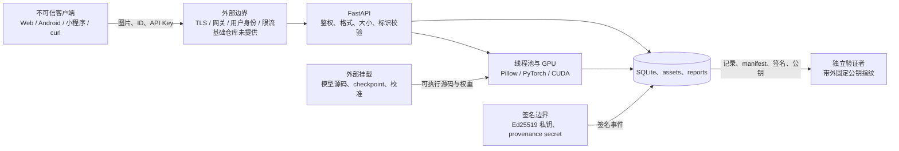

# 鉴源盾威胁模型

> 审阅日期：2026-08-04
>
> 适用范围：当前仓库中的 FastAPI 后端、Web/Android/小程序客户端、SQLite 来源登记、模型适配器、证据签名与 Docker 部署。
>
> 结论口径：本文记录“已有控制、剩余风险和验证方式”，不表示风险已经消除，也不构成司法效力、可信时间、真实身份或内容真实性证明。

## 1. 目标、范围与安全不变量

本威胁模型保护的是“上传内容经过指定 checkpoint 处理后，与应用侧登记记录和签名事件之间的技术绑定”。安全目标包括：

- 尽量减少原始图片、创作者引用和密钥的泄露；
- 使登记记录、核验事件、checkpoint、阈值和证据文件的非授权修改可被发现；
- 限制恶意图片、并发请求和失控模型对 CPU、内存、磁盘、线程及 GPU 的占用；
- 让 `claim_valid` 在模型、校准、签名、密钥或信任锚缺失时 fail closed；
- 清楚区分“比特恢复达到阈值”“登记记录匹配”“证据字节完整”与“内容真实/司法采信”。

下列能力不在当前仓库的保证范围内：自然人实名认证、租户隔离、可信时间戳、密钥硬件托管、不可篡改审计账本、法律证据保全程序、主机或 GPU 驱动被攻陷后的防护，以及任何未经真实数据和冻结协议复核的模型性能结论。公开部署所需的 TLS 终止、WAF/速率限制、用户身份系统和集中式审计也不由基础 Compose 提供。

## 2. 资产

| 编号 | 资产 | 主要安全属性 | 当前落点 |
|---|---|---|---|
| A1 | 用户上传图片及其内存/临时副本 | 高保密性、完整性 | HTTP multipart、进程内存、容器 `/tmp` |
| A2 | `creator_ref`、`content_id`、消息材料、原图/保护图哈希 | 高完整性、中高保密性 | SQLite `provenance_records` |
| A3 | 受保护图片、推理衍生图、核验事件 | 高完整性、中等保密性 | assets、reports、SQLite |
| A4 | checkpoint、模型源码、协议、权重清单、阈值校准 artifact | 关键完整性 | `weights`、`model-sources`、`configs` |
| A5 | Ed25519 私钥、公钥指纹、`JYS_PROVENANCE_SECRET`、API Key | 关键保密性与完整性 | 环境变量、部署方文件或外部秘密系统 |
| A6 | evidence bundle、实验报告、原始逐图结果和日志 | 高完整性、按内容确定保密性 | reports、标准输出、日志收集系统 |
| A7 | CPU、内存、磁盘、线程池、GPU 和服务可用性 | 高可用性 | 宿主机/容器运行时 |
| A8 | 客户端 API 地址、静态凭据、历史记录和缓存 | 中高保密性与完整性 | 浏览器、Android DataStore、小程序运行环境 |

## 3. 信任边界与数据流



需要分别审查的信任跨越是：客户端到 HTTP API、API 到原生图像/模型解码器、应用到可写文件系统和 SQLite、运行时代码到外部模型挂载、签名进程到密钥存储、容器到宿主机/GPU，以及证据包到带外信任锚。只读挂载表示“容器不能写”，不表示挂载内容可信。

## 4. 攻击者能力

- **远程匿名攻击者**：可访问公开的 `/api/health`、`/api/projects`、`/api/claims`；当演示模式未要求 API Key 或端口直接暴露时，也可调用上传和计算接口。
- **共享 API Key 持有者**：可提交恶意图片、消耗资源，并查询其获知 `content_id` 的登记对象；当前没有用户、角色或租户区别。
- **恶意或被逆向的客户端**：可提取前端/小程序静态值、修改请求、重放请求或将图片发送到被替换的服务地址。
- **文件系统或部署配置攻击者**：可尝试读取密钥，修改/回滚 SQLite、manifest、校准文件、checkpoint、模型源码、日志和受保护图片。
- **供应链攻击者**：可在 Python 模型源码、checkpoint、依赖包、基础镜像、CUDA/图像原生库中植入恶意内容。
- **资源耗尽攻击者**：可利用高压缩图片、批量上传、排队请求、长时间或永不返回的 GPU 运算耗尽内存、线程、连接、磁盘或 GPU。

主机 root、Docker daemon、内核或 GPU 驱动完全失陷后，应用层签名与容器限制不能提供强隔离；这属于必须由部署基础设施承担的风险。

## 5. 威胁—控制—剩余风险—验证映射

优先级含义：**P0** 为公开或正式证据部署前的阻断项，**P1** 为受控演示前应明确处置或接受的高风险，**P2** 为纵深防御项。优先级描述处置顺序，不代表漏洞已经被利用。

### TM-01 上传、图像解析与解码滥用 — P1

- **威胁**：伪造 MIME、畸形 JPEG/PNG/WebP、解压炸弹、极端尺寸、批量上传或解码器漏洞可造成内存/CPU 耗尽，甚至触发 Pillow/底层编解码库缺陷。模型 decoder 还会处理攻击者可控像素。
- **已有控制**：[security.py](../system/backend/security.py) 将单文件读取限制为配置上限加 1 字节，默认限制 5 MiB 和 1600 万像素，只接受三种媒体类型，核对 Pillow 实际格式并执行 `Image.verify()`；实际 RGB 解码再次检查像素数。批量文件数默认限制为 16，生产模式会要求 API Key。
- **剩余风险**：16 个接近上限的文件仍可能同时占用约 80 MiB 原始字节及额外解码内存；像素阈值内的图片仍可昂贵；Pillow、libjpeg、WebP 等依赖漏洞不受格式检查消除。当前没有网关级请求体上限、速率限制、全局队列上限、每用户配额或解码进程隔离。multipart 框架也可能在应用校验前产生临时缓冲。
- **验证方式**：现有 [test_security.py](../tests/test_security.py) 覆盖 MIME/内容不一致、像素上限和有效图片。执行 `python3 -m unittest -v tests.test_security`；发布前还应对三种格式做畸形样本 fuzz、并发最大批量压测，并从反向代理和容器指标确认请求体、内存和 CPU 上限真正生效。

### TM-02 路径穿越与任意文件读取 — P2

- **威胁**：攻击者通过文件名、`sample_id`、`task_id`、`content_id`、artifact 路径、报告格式或校准 artifact 路径读取仓库外文件。
- **已有控制**：[routes.py](../system/backend/routes.py) 对样本/任务标识使用严格白名单，对来源 ID 要求 32 位小写十六进制，对下载格式采用固定映射；artifact 先 `resolve()` 再验证位于 assets 根内且仅允许图片后缀。[security.py](../system/backend/security.py) 只把客户端文件名的 basename 用于显示；[provenance.py](../system/backend/provenance.py) 也约束校准文件必须位于 manifest 目录内。
- **剩余风险**：路径校验与 `FileResponse` 打开文件之间仍存在本地攻击者可利用的竞态窗口；可写 assets 树内的符号链接和宿主卷权限必须继续受控。绝对 `JYS_PROVENANCE_DB` 路径属于受信部署配置，不应允许不受信用户设置。后续新增路由若绕过这些 helper，会重新引入风险。
- **验证方式**：现有 `SecurityTests.test_identifiers_reject_path_traversal` 和 `test_artifact_route_rejects_path_traversal` 覆盖主要入口。除单元测试外，发布检查应包含 URL 编码、双重编码、反斜杠、符号链接和校准路径逃逸用例，并检查容器卷只有运行用户可写。

### TM-03 GPU DoS、排队与超时线程 — P1

- **威胁**：昂贵或卡死的模型调用可占满 CUDA、线程池和请求连接；HTTP 超时后底层 Python 线程/GPU kernel 不会自动停止，连续超时可能形成隐藏并发。
- **已有控制**：[routes.py](../system/backend/routes.py) 默认用单并发 `asyncio.Semaphore` 包裹真实单图、保护和核验调用，并设置默认 120 秒执行超时。超时或取消后，槽位会一直保留到后台 worker 实际退出，避免同一进程继续启动新的 CUDA 任务。Docker 当前固定一个 Uvicorn worker，并设置 PID 上限。
- **剩余风险**：无法强杀的 worker 若永久挂起，会永久占用该进程的槽；等待 semaphore 的时间不在执行超时内，大量排队请求仍可耗尽连接和内存。semaphore 是进程内控制，多 worker/多副本不会共享。PID 上限不限制 GPU 显存、CPU、内存或请求数；当前 `/api/compliance/batch` 未经过该 wrapper，虽然它暂时只返回能力不可用状态，未来接入模型时必须补齐。
- **验证方式**：`python3 -m unittest -v tests.test_backend.BackendSmokeTests.test_timed_out_worker_keeps_inference_slot_until_it_exits` 验证超时 worker 退出前不会释放槽。发布前还必须以故意阻塞的 adapter 验证 504、队列上限、熔断和进程回收，并在多副本部署中通过外部队列/分布式配额验证总 GPU 并发。

### TM-04 SQLite 记录篡改、回滚与删除 — P0

- **威胁**：有卷写权限的攻击者可修改重复列或 `record_json`，删除/回滚登记与核验事件，替换 WAL/数据库文件，或诱导服务基于篡改后的行签发新事件。
- **已有控制**：[provenance.py](../system/backend/provenance.py) 使用参数化 SQL、事务、外键、WAL 和进程内锁；登记 JSON 与核验事件可使用 Ed25519 签名。核验在加载 adapter 前比较 SQLite 重复列与登记 JSON 的 content、主体、模型、文件哈希、checkpoint 和时间绑定，不一致即拒绝；新事件同时绑定父登记 payload 哈希和父记录 `claim_valid`，父签名或其 checkpoint/校准证据失效时事件不能获得正式 claim。读取记录仍会重新计算 checkpoint 注册、校准和签名状态；写库失败会回滚新建保护图。
- **剩余风险**：SQLite 不是防篡改账本，没有对象权限、加密、外部审计、可信版本或远端不可变备份。合法旧库和旧资产仍可整体回滚，记录可被删除，系统时钟可被修改；未启用服务端 secret 的兼容记录把随机消息位保存在数据库中，只能作为 `operational_unverified` 使用。
- **验证方式**：[test_provenance.py](../tests/test_provenance.py) 覆盖 `record_json.creator_ref` 篡改导致查询 claim 降级与后续 verify 拒绝，并覆盖父校准证据失效时子事件无法取得 claim。发布阻断测试继续覆盖其余重复列、WAL/SHM 替换、删除和旧快照回滚；在外部不可变审计完成前，不把 SQLite 记录描述为不可抵赖。

### TM-05 Checkpoint、模型源码与依赖供应链 — P0

- **威胁**：恶意 checkpoint、外部 Python 模型源码、依赖包、基础镜像或 CUDA/图像原生库可造成任意代码执行、后门输出或伪造结果。
- **已有控制**：在线 [model_adapters.py](../system/backend/model_adapters.py)、评测 adapters 与仓库脚本统一采用 `torch.load(..., weights_only=True)`；模型组件使用严格 `load_state_dict(..., strict=True)`。正式 `claim_valid` 要求 checkpoint SHA-256 命中部署方 `WEIGHT_MANIFEST.json` 的 approved/verified 项，并要求该清单及其引用的 checkpoint、校准 artifact 同时出现在由固定 Ed25519 公钥签发且完整验真的 evidence bundle 中。模型源码和权重在 [docker-compose.models.yml](../docker-compose.models.yml) 中以只读方式显式挂载。
- **剩余风险**：`weights_only=True` 不验证模型语义，也不约束被 import 的 Python 源码；多个 adapter 会把外部 `model-sources` 加入 `sys.path` 并执行。当前 claim gate 尚未在每次请求中证明 `source_revision` 和源码树哈希，也不会在每次 decode 前重新散列已加载 adapter 对应的 checkpoint，仍存在加载与登记之间的 TOCTOU 风险。正式构建已强制基础镜像 digest、哈希 lockfile、CycloneDX SBOM 和 BuildKit provenance；第三方模型源码审阅、持续漏洞扫描与外部透明日志仍需由发布流程执行。
- **验证方式**：每次发布应离线复算 checkpoint、manifest、校准文件和模型源码树哈希，将 Git commit、镜像 digest、lockfile/SBOM 与审批人记录放入独立签名证据；再在无网络、最小权限环境加载。审查时搜索 `torch.load`、动态 import 和 `sys.path` 修改，并拒绝任何未在冻结清单中的源码/权重。只读挂载检查只能证明运行时写保护，不能代替来源审核。

### TM-06 签名私钥、固定公钥指纹与信任锚 — P0

- **威胁**：私钥泄露可伪造新记录；公钥和签名一起被替换会让自验签“成功”；错误指纹配置、密钥回滚或时间篡改会削弱证据解释。
- **已有控制**：[signing.py](../system/backend/signing.py) 对 canonical JSON 使用 Ed25519，验签时从嵌入公钥重新计算 SHA-256 指纹而不信任签名对象自报值；生成的文件私钥拒绝覆盖并设为 `0600`。签名清单会递归纳入 weight manifest 引用的 checkpoint 与校准 artifact。来源 `claim_valid` 要求该 bundle 完整验真并覆盖当前 weight manifest、实际签名公钥指纹与独立配置的 `JYS_EVIDENCE_PUBLIC_KEY_FINGERPRINT` 常量时间相等，同时要求至少 32 字符的 provenance secret。
- **剩余风险**：当前私钥是进程可读的无口令 PEM；基础 Compose 只传入路径配置，没有提供 KMS/HSM、secret mount、轮换、吊销、双人审批或密钥使用审计。若验证者没有通过带外可信渠道预先获得指纹，攻击者可同时替换公钥、签名和指纹配置。事件时间来自普通系统时钟，不是可信时间戳；签名只说明相应私钥对字节签过名，不证明签名者自然人身份、内容真实性或司法效力。
- **验证方式**：[test_signing.py](../tests/test_signing.py) 覆盖内容篡改、独立验签和伪造指纹字段；`test_signed_checkpoint_binding_unlocks_formal_claim` 覆盖固定指纹门禁。部署时必须从第二可信通道核对指纹，验证密钥文件权限和容器不可读取其他密钥，并演练轮换/吊销、旧证据验证、错误指纹 fail closed 及密钥不可用路径。

### TM-07 阈值校准与统计误用 — P1

- **威胁**：对当前数据过拟合、缺少负样本、身份泄漏、域漂移或攻击分布变化会让比特准确率阈值产生高误接收/误拒绝；攻击者还可替换校准文件或配置有利阈值。
- **已有控制**：[calibrate_provenance_threshold.py](../system/scripts/calibrate_provenance_threshold.py) 以身份为组确定性划分 calibration/holdout，逐图片、逐攻击生成登记回环、无水印和错误消息三类对照，只用 calibration 选择模型/checkpoint 专属阈值，并在 holdout 报告 FAR、FRR、TAR 与 Wilson 95% 区间。[provenance.py](../system/backend/provenance.py) 从逐样本行重建完整笛卡尔覆盖、拒绝身份跨 split、重算阈值选择和两组指标，再与 manifest 的 holdout 样本数/FAR 对齐；任何缺行、重复、非有限值、元数据伪造或哈希不一致均 fail closed。
- **剩余风险**：代码尚未规定所有模型与场景统一的最小 holdout 样本量或置信上界门槛；经验 FAR 达标不等于真实总体 FAR 已被证明。同一阈值不能自动外推到新 checkpoint、新域、新攻击分布或扩大候选搜索空间后的验证器。
- **验证方式**：[test_provenance.py](../tests/test_provenance.py) 覆盖 artifact 字节篡改、身份泄漏、holdout 指标伪造、缺行伪造、阈值选择篡改和 NaN/Infinity；[test_threshold_calibration.py](../tests/test_threshold_calibration.py) 覆盖 identity split、三对照完整性、calibration-only 选阈与 Wilson 区间。正式发布按 checkpoint/域/攻击冻结足量样本，并同时审查经验率和置信区间上界。

### TM-08 重放、对象级授权与租户隔离 — P0

- **威胁**：攻击者重放 protect/verify 请求，反复生成“新”核验事件；共享 Key 持有者在获知别人的 `content_id` 后查询登记、下载保护图或发起核验；应用侧 `creator_ref` 被误解为已认证身份。
- **已有控制**：受保护路由统一使用可选 `X-API-Key`；`content_id` 和 `event_id` 使用随机 UUID，来源 ID 格式严格，未知 ID 返回 404。每个核验事件包含新事件 ID、观测哈希、普通时间戳和签名，便于事后关联。
- **剩余风险**：系统只有一个共享 API Key，没有用户主体、角色、scope、对象所有者、租户行级权限、一次性 nonce、客户端挑战、幂等键或重放拒绝。随机 `content_id` 降低盲猜概率但不是授权；获取 ID 的任一 Key 持有者可访问对象。重复 verify 是合法操作，事件时间也不能证明请求新鲜性。`creator_ref` 只是调用方提供的字符串，不是实名凭据。
- **验证方式**：现有测试仅覆盖未知 content ID，尚无对象级授权或重放测试。公开部署前应以两个独立用户/租户做交叉读取、artifact 下载、protect/verify、Key 吊销和枚举测试；加入服务端主体与 owner 绑定后，所有跨对象请求必须返回 403，并以 nonce/idempotency 用例验证定义好的重放策略。

### TM-09 浏览器、Android、小程序与 API Key — P0

- **威胁**：静态客户端中的长期 Key 可被源码、调试器、代理、设备备份或逆向提取；HTTP 或错误服务地址可泄露图片和凭据；CORS 被误当成鉴权。
- **已有控制**：[miniprogram/utils/config.js](../miniprogram/utils/config.js) 只接受标准 HTTPS 注册域名并可从 `extConfig` 注入 `X-API-Key`，文档明确静态 Key 可提取。[Android release 网络配置](../android/app/src/main/res/xml/network_security_config.xml) 禁止明文流量，debug 只为模拟器宿主放行；release 关闭 OkHttp 日志。Web 的 API base 默认跟随页面协议和主机。后端生产模式会在 Key 缺失时 fail closed，CORS 默认限于本机来源且默认不携带凭据。
- **剩余风险**：静态 Key 在浏览器/小程序/移动端都不能成为长期秘密。当前 [Web app.js](../system/frontend/app.js) 和 [Android NetworkModule.kt](../android/app/src/main/java/com/vpsg/jianyuanshield/data/remote/NetworkModule.kt) 没有注入 `X-API-Key`，生产鉴权开启后依赖外部会话/网关，否则受保护请求会失败；Android 允许用户选择 HTTPS 主机但没有证书 pinning。基础 Web Compose 使用 HTTP。CORS 只限制浏览器读取响应，不能阻止 curl、移动端或已获 Key 的攻击者。
- **验证方式**：对 release 包、source map、`extConfig`、DataStore、日志和抓包结果执行凭据搜索；在生产配置下分别验证 Web/Android/小程序无凭据请求失败、短期令牌过期/吊销有效、HTTPS 降级失败、服务地址替换有明显提示。长期 Key 不应出现在任何客户端构建产物中。

### TM-10 日志、隐私与数据生命周期 — P1

- **威胁**：原图、受保护图、`creator_ref`、content ID、错误输入、路径、Key 或模型结果可能经资产、SQLite、stdout、轮转日志、客户端历史、备份和监控长期泄露。
- **已有控制**：来源保护仅持久化保护图和原始字节 SHA-256，不保存原图；单图推理只保存水印/攻击/热图/差分衍生图，不落盘原图。[infer.py](../system/backend/infer.py) 对 12 位任务目录做默认一小时的机会式 TTL 清理，并明确排除 provenance 目录。[logging_config.py](../system/backend/logging_config.py) 的本地文件限制为约 2 MB、3 个备份；应用代码不主动记录请求体或 API Key，release Android 关闭 HTTP 日志。
- **剩余风险**：保护图、SQLite 记录和核验事件没有 TTL/删除/导出策略；推理清理只在新单图请求时触发、每次最多 100 个，不是保证删除。上传仍会经过内存和 multipart 临时缓冲；验证错误日志可能包含输入摘要，异常/工具日志可能包含本地路径；stdout 收集和外部备份的保留期不受本地轮转控制。数据未声明静态加密，creator 引用可能是个人信息，protected image 和哈希也可能具有可关联性。客户端缓存/历史同样不受后端删除控制。
- **验证方式**：使用带唯一标记的合成图片和 creator 引用走完全流程，再检查容器 `/tmp`、assets、reports、SQLite、stdout、轮转文件、备份及客户端存储；分别验证 TTL、删除申请、备份到期和日志脱敏。发布前应形成字段级数据清单、合法用途、保留期、访问角色和事件响应流程，并配置反向代理禁止记录鉴权头与 multipart body。

### TM-11 容器、宿主机与网络边界 — P0

- **威胁**：容器逃逸、过宽 Linux 权限、可写卷、公开 HTTP 端口、未鉴权演示配置、GPU 设备和无资源配额可导致数据泄露、持久化或宿主机资源耗尽。
- **已有控制**：[Dockerfile](../Dockerfile) 以 UID 10001 非 root 用户运行；[docker-compose.yml](../docker-compose.yml) 对 API/Web 使用只读根文件系统、`/tmp` tmpfs、`cap_drop: ALL`、`no-new-privileges`，API 设置 PID 上限和健康检查；模型权重/源码覆盖文件要求显式宿主路径并只读挂载。健康状态会报告磁盘余量和生产鉴权是否就绪。
- **剩余风险**：基础 Compose 将 8026/8027 绑定到所有宿主接口，且默认 `JYS_MODE=demo`、demo 开启、API Key 非必需并使用 HTTP；不能直接作为公网配置。reports/assets/data 卷仍可写，健康检查发现低磁盘并不会阻止所有写入。没有显式 CPU/内存/GPU/磁盘配额、seccomp/AppArmor 配置、网络策略、只读镜像 digest、secret mount 或反向代理 TLS；GPU 驱动扩大了容器—宿主攻击面。Docker daemon 或宿主 root 可读取/改写全部卷和环境。
- **验证方式**：执行 `docker compose config` 审核最终合并配置；在预发布环境确认只监听反向代理私网、生产模式和 Key 强制开启、TLS/HSTS 生效、卷/secret 权限正确，并用 `docker inspect` 验证用户、capabilities、只读根和资源限制。做低磁盘、OOM、PID、GPU 卡死、容器重启和卷恢复演练；基础 Compose 默认值不得通过公网扫描测试。

### TM-12 证据解释、身份与“司法效力”越界 — P1

- **威胁**：使用方把 `verified=true`、`claim_valid=true` 或 Ed25519 验签成功误解为图片未被编辑、创作者自然人身份已核验、事件发生于可信时间，或材料必然获司法采信。
- **已有控制**：API 将比特恢复结果、精确文件哈希匹配、checkpoint/校准门禁和 `claim_valid` 分开表达；签名可独立验证具体 JSON 字节，README 和限制文档明确不承诺内容真实性或司法效力。
- **剩余风险**：签名真实性取决于私钥控制和带外公钥信任；`creator_ref` 没有接入身份提供方，时间来自系统时钟，SQLite 没有不可变保全链。模型误差、密钥泄露、数据库回滚和操作流程断点都会影响结论。司法采信还取决于管辖地规则、取证过程、主体资格和第三方鉴定，均不由代码自动满足。
- **验证方式**：答辩、UI、API、导出报告和说明书必须统一使用“登记匹配/达到阈值/签名字节完整”等限定措辞；由非研发人员做误读测试。正式取证场景应另行经过法律审查、可信时间服务、身份认证、密钥托管和全链路保全验证，不能用本仓库测试替代。

## 6. 当前发布阻断项

在以下事项完成或由责任人书面接受前，不应将基础 Compose 暴露到公网，也不应对外宣称不可抵赖或司法效力：

1. 在 TLS 网关后启用生产模式、速率限制、队列上限、用户身份和对象级授权；
2. 修复并测试“验签登记记录后再核验”，消除或校验 SQLite 重复列，接入不可变远端审计/备份；
3. 固定并签名模型源码、checkpoint、manifest、校准 artifact、依赖 lockfile 和容器 digest；
4. 将 Ed25519 私钥与 provenance secret 放入 KMS/HSM 或受审计 secret store，并建立带外指纹、轮换和吊销流程；
5. 用冻结的正负逐样本数据独立重算阈值、FAR/FRR/ROC/区间，并验证身份隔离和域外泛化边界；
6. 建立数据保留、删除、备份、日志脱敏和隐私事件响应制度；
7. 对失控 GPU worker 使用可回收进程/作业隔离，并在多副本层面限制总并发。

## 7. 可复核基线

下列命令验证当前已有的相关自动化控制；通过只说明这些测试覆盖的行为成立，不代表整份威胁模型的剩余风险已经关闭：

```bash
python3 -m unittest -v \
  tests.test_security \
  tests.test_backend.BackendSmokeTests.test_timed_out_worker_keeps_inference_slot_until_it_exits \
  tests.test_provenance \
  tests.test_signing
python3 scripts/check_documentation.py
docker compose config --quiet
git diff --check -- README.md docs/THREAT_MODEL.md
```

发布证据应记录：Git commit、工作区是否干净、镜像 digest、依赖 lockfile/SBOM、模型源码 revision 与树哈希、checkpoint/manifest/校准哈希、协议版本、测试原始输出、部署配置摘要、签名公钥指纹及其带外确认渠道。任一关键项变化都应重新审阅本文。

## 8. 复审触发条件

新增或改变上传格式、API 路由、鉴权方式、数据库 schema、模型/攻击、阈值协议、签名算法/密钥、客户端存储、日志字段、容器基础镜像、GPU/依赖版本、挂载路径或公网拓扑时，必须重新执行威胁建模和对应负向测试。其他已知能力与科研边界同时参见 [LIMITATIONS.md](LIMITATIONS.md) 和 [EVALUATION_PROTOCOL.md](EVALUATION_PROTOCOL.md)。
